<div align="center">
# 🐧 FEDORA LINUX · ШПАРГАЛКА АДМІНІСТРАТОРА
 
**Fedora 44 · KDE Plasma · Btrfs + Snapper · NVIDIA · Docker/Podman**
 
*Особистий довідник: знайшов → скопіював → виконав*
 


 
</div>
---
 
## 🧭 Як користуватися
 
| Позначка | Значення |
|:---:|---|
| 🟢 | Безпечно, можна виконувати без роздумів |
| 🟡 | Змінює систему, перевір перед запуском |
| 🔴 | Небезпечно / незворотно, спершу зроби сніпшот |
| 💡 | Корисна порада |
| 🆕 | Додано до твоєї версії |
 
> [!TIP]
> Шукай команду через `Ctrl+F` за тегом, наприклад `#nvidia`, `#snapper`, `#firewalld`.
> `<...>` у командах означає, що значення потрібно підставити своє.
 
---
 
## 📑 Зміст
 
1. [⚡ Топ-15: команди на кожен день](#-топ-15-команди-на-кожен-день)
2. [📦 Пакети та оновлення (DNF5)](#-1-пакети-та-оновлення-dnf5)
3. [📚 Flatpak 🆕](#-2-flatpak-)
4. [💾 Btrfs + Snapper](#-3-btrfs--snapper)
5. [🧠 Ядро, NVIDIA, GRUB](#-4-ядро-nvidia-grub)
6. [⚙️ Systemd](#️-5-systemd)
7. [🛡️ Мережа та безпека](#️-6-мережа-та-безпека)
8. [🐳 Docker / Podman](#-7-docker--podman)
9. [📊 Моніторинг: диски, пам'ять, процеси 🆕](#-8-моніторинг-диски-память-процеси-)
10. [👤 Користувачі та права 🆕](#-9-користувачі-та-права-)
11. [🐍 Середовище розробки Python 🆕](#-10-середовище-розробки-python-)
12. [🚑 SOS-сценарії](#-11-sos-сценарії)
13. [🏷️ Індекс тегів](#️-індекс-тегів)
---
 
## 🗺️ Карта системи
 

 
---
 
## ⚡ Топ-15: команди на кожен день
 
```bash
sudo dnf upgrade --refresh              # 🟡 оновити все
dnf search <назва>                      # 🟢 знайти пакет
sudo dnf install <пакет>                # 🟡 встановити
sudo dnf remove <пакет>                 # 🟡 видалити
sudo snapper -c root create -d "Перед змінами"   # 🟢 сніпшот
snapper ls                              # 🟢 список сніпшотів
systemctl status <служба>               # 🟢 стан служби
sudo systemctl enable --now <служба>    # 🟡 автозапуск + старт
journalctl -b -p err                    # 🟢 помилки з поточного завантаження
sudo firewall-cmd --list-all            # 🟢 правила фаєрвола
df -h                                   # 🟢 вільне місце
sudo btrfs filesystem usage /           # 🟢 реальне місце на Btrfs
docker ps -a                            # 🟢 усі контейнери
sudo dnf history                        # 🟢 історія транзакцій
sestatus                                # 🟢 режим SELinux
```
 
> [!IMPORTANT]
> **Золоте правило перед оновленням ядра, драйверів чи великим `dnf upgrade`:** зроби сніпшот. Це 3 секунди проти 3 годин відновлення.
 
---
 
# 📦 1. Пакети та оновлення (DNF5)
 
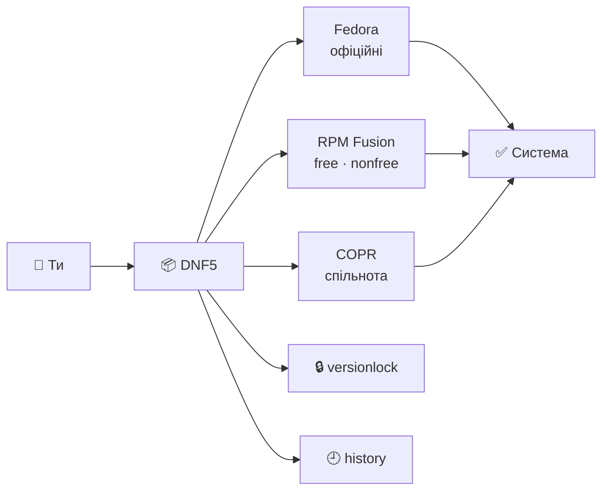
 
## 🔹 Базові операції
`#dnf` `#packages` `#update`
 
| Дія | Команда |
|---|---|
| 🟡 Оновити систему | `sudo dnf upgrade --refresh` |
| 🟢 Знайти пакет | `dnf search <слово>` |
| 🟢 Інформація про пакет | `dnf info <пакет>` |
| 🟡 Встановити | `sudo dnf install <пакет>` |
| 🟡 Видалити | `sudo dnf remove <пакет>` |
| 🟡 Видалити сиріт-залежності 🆕 | `sudo dnf autoremove` |
| 🟡 Перевстановити 🆕 | `sudo dnf reinstall <пакет>` |
| 🟡 Відкотити версію пакета 🆕 | `sudo dnf downgrade <пакет>` |
| 🟢 Який пакет дає файл/команду? 🆕 | `dnf provides */<назва_файлу>` |
| 🟢 Список встановлених 🆕 | `dnf list --installed` |
| 🟢 Є оновлення? 🆕 | `dnf check-upgrade` |
| 🟡 Очистити кеш 🆕 | `sudo dnf clean all` |
| 🟡 Встановити групу пакетів 🆕 | `sudo dnf group install development-tools` |
| 🟢 Чи потрібне перезавантаження? 🆕 | `sudo dnf needs-restarting -r` |
 
> 💡 Ключ `--refresh` примусово оновлює метадані. Корисно після додавання репозиторію.
 
## 🔹 Репозиторії: RPM Fusion та COPR
`#repos` `#rpmfusion` `#copr`
 
```bash
# 🟢 Підключені репозиторії
dnf repolist
 
# 🟡 Підключити RPM Fusion (free + nonfree) 🆕
sudo dnf install \
  https://mirrors.rpmfusion.org/free/fedora/rpmfusion-free-release-$(rpm -E %fedora).noarch.rpm \
  https://mirrors.rpmfusion.org/nonfree/fedora/rpmfusion-nonfree-release-$(rpm -E %fedora).noarch.rpm
 
# 🟡 Підключити COPR
sudo dnf copr enable <користувач>/<репозиторій>
 
# 🟡 Вимкнути COPR 🆕
sudo dnf copr disable <користувач>/<репозиторій>
```
 
<details>
<summary>📄 Приклад виводу <code>dnf repolist</code></summary>
```text
repo id                    repo name
fedora                     Fedora 44 - x86_64
fedora-cisco-openh264      Fedora 44 openh264 (From Cisco) - x86_64
rpmfusion-free             RPM Fusion for Fedora 44 - Free
rpmfusion-nonfree          RPM Fusion for Fedora 44 - Nonfree
```
</details>
> [!WARNING]
> COPR це збірки спільноти без гарантій. Підключай лише те, чому довіряєш, і відстежуй що саме встановлюєш.
 
## 🔹 Versionlock та історія
`#versionlock` `#history`
 
```bash
sudo dnf versionlock add <пакет>        # 🟡 заморозити версію (kernel, akmod-nvidia)
dnf versionlock list                    # 🟢 що заморожено
sudo dnf versionlock delete <пакет>     # 🟡 розморозити
 
dnf history                             # 🟢 нумерований список транзакцій
dnf history info <номер>                # 🟢 що саме змінила транзакція 🆕
sudo dnf history undo <номер>           # 🔴 скасувати транзакцію
```
 
> 💡 Якщо плагін versionlock не знайдено: `sudo dnf install python3-dnf-plugin-versionlock` (DNF4) або `sudo dnf install dnf5-plugins` (DNF5).
 
## 🔹 Перехід на нову версію Fedora 🆕
`#upgrade` `#release`
 
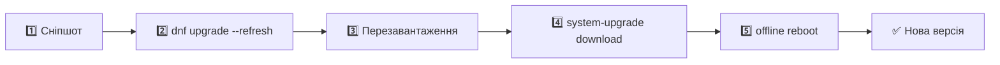
 
```bash
sudo snapper -c root create -d "Перед апгрейдом Fedora"
sudo dnf upgrade --refresh
sudo reboot
sudo dnf system-upgrade download --releasever=<N>
sudo dnf offline reboot
```
 
> [!NOTE]
> Заздалегідь перевір сумісність драйвера NVIDIA з новою версією та які COPR-репозиторії у тебе підключені: вони найчастіше ламають апгрейд.
 
---
 
# 📚 2. Flatpak 🆕
 
`#flatpak` `#apps`
 
```bash
flatpak remotes                          # 🟢 підключені джерела
flatpak search <назва>                   # 🟢 пошук
flatpak install flathub <app.id>         # 🟡 встановити
flatpak list                             # 🟢 встановлене
flatpak update                           # 🟡 оновити все
flatpak uninstall <app.id>               # 🟡 видалити
flatpak uninstall --unused               # 🟡 прибрати невикористані runtime
flatpak run <app.id>                     # 🟢 запустити з терміналу
```
 
---
 
# 💾 3. Btrfs + Snapper
 
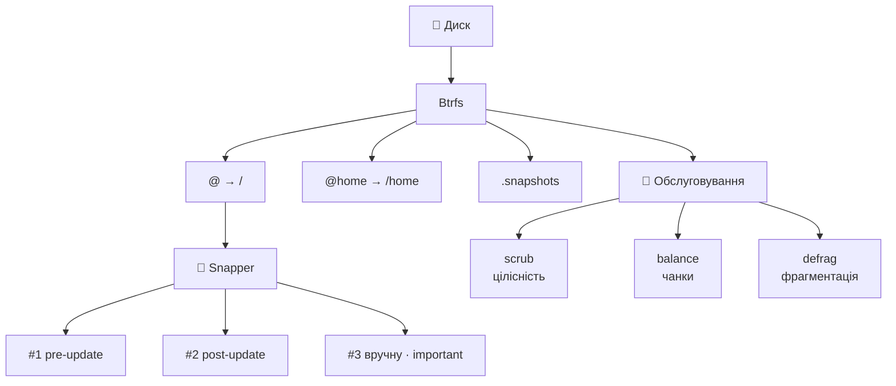
 
## 🔹 Субтоми
`#btrfs` `#subvolumes`
 
```bash
sudo btrfs subvolume list /                  # 🟢 усі субтоми з ID
sudo btrfs subvolume create /шлях/субтому    # 🟡 створити
sudo btrfs subvolume delete /шлях/субтому    # 🔴 видалити з даними
sudo btrfs subvolume show /                  # 🟢 деталі субтому 🆕
```
 
> 💡 Бази даних (PostgreSQL) і кеш Docker краще винести в окремий субтом, щоб вони не потрапляли у сніпшоти й не роздували їх.
> Для таких директорій також корисний `chattr +C <папка>` (вимкнути Copy-on-Write) **до** створення файлів усередині.
 
## 🔹 Сніпшоти Snapper
`#snapper` `#snapshots` `#recovery`
 
| Дія | Команда |
|---|---|
| 🟢 Список | `snapper ls` |
| 🟢 Створити ручний | `sudo snapper -c root create --type single -d "Опис"` |
| 🟢 Що змінилось між знімками 🆕 | `sudo snapper -c root status 5..8` |
| 🟢 Diff конкретного файлу 🆕 | `sudo snapper -c root diff 5..8 /etc/fstab` |
| 🟡 Повернути файли | `sudo snapper -c root undochange 5..8` |
| 🔴 Повний відкат | `sudo snapper --ambit classic rollback <номер>` |
| 🔴 Видалити знімок 🆕 | `sudo snapper -c root delete <номер>` |
| 🟡 Позначити важливим | `sudo snapper modify -u important=yes <номер>` |
 
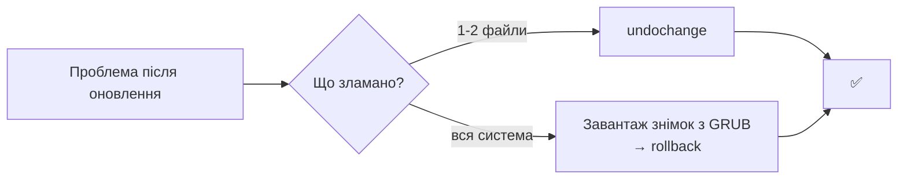
 
> [!WARNING]
> **Rollback** створює новий субтом і робить його кореневим. Після нього обов'язково перезавантаж ПК. Команда коректна лише для сумісної схеми субтомів Snapper. Якщо система встановлена зі стандартною розміткою Fedora, надійніше відкочуватися через завантаження знімка з меню GRUB.
 
## 🔹 Ліміти та очищення
`#snapper` `#cleanup`
 
```bash
sudo nano /etc/snapper/configs/root
# NUMBER_LIMIT="10"
# NUMBER_LIMIT_IMPORTANT="0"
 
sudo snapper -c root cleanup number      # 🟡 примусове очищення за лімітом
sudo snapper -c root cleanup timeline    # 🟡 очищення за часовою шкалою
```
 
## 🔹 Обслуговування простору
`#maintenance` `#scrub` `#balance`
 
| Операція | Команда | Навіщо |
|---|---|---|
| 🟢 Scrub | `sudo btrfs scrub start /` | перевірка контрольних сум, виявляє bit rot |
| 🟢 Статус scrub | `sudo btrfs scrub status /` | прогрес і кількість помилок |
| 🟡 Balance | `sudo btrfs balance start -dusage=10 /` | звільнити напівпорожні чанки, лікує хибне «No space left» |
| 🟡 Defrag | `sudo btrfs filesystem defragment -r -v /шлях` | дефрагментація (не роби на `/` без потреби) |
| 🟢 Реальне заняте місце 🆕 | `sudo btrfs filesystem usage /` | точніше за `df` |
| 🟢 Лічильники помилок 🆕 | `sudo btrfs device stats /` | помилки читання/запису/corruption |
 
> [!CAUTION]
> Defrag ламає спільні блоки (reflink) між сніпшотами, тому місце може різко збільшитись. Для SSD зазвичай не потрібен.
 
---
 
# 🧠 4. Ядро, NVIDIA, GRUB
 

 
## 🔹 Модулі: akmods та dracut
`#kernel` `#akmods` `#dracut`
 
```bash
sudo akmods --force                       # 🟡 перезібрати модулі для поточного ядра
sudo dracut --force                       # 🟡 перегенерувати initramfs
lsmod | grep -e nvidia -e nouveau         # 🟢 який драйвер активний
uname -r                                  # 🟢 версія поточного ядра 🆕
rpm -q kernel                             # 🟢 встановлені ядра 🆕
```
 
## 🔹 NVIDIA: перевірка та діагностика
`#nvidia` `#gpu` `#troubleshooting`
 
```bash
modinfo -F version nvidia                 # 🟢 версія зібраного модуля
systemctl status akmods                   # 🟢 лог збірки
nvidia-smi                                # 🟢 стан GPU, температура, процеси 🆕
rpm -qa | grep -i nvidia                  # 🟢 які пакети NVIDIA стоять 🆕
sudo dnf install kernel-devel             # 🟡 заголовки, без них akmods не збере модуль 🆕
```
 
> [!TIP]
> **Правило безпечного оновлення NVIDIA:** після `dnf upgrade`, що чіпає ядро чи драйвер, **не перезавантажуйся одразу**. Зачекай 3-5 хвилин (поки `akmods` збере модуль) і перевір `modinfo -F version nvidia`.
 
> [!NOTE]
> Якщо увімкнений **Secure Boot**, неподписаний модуль NVIDIA не завантажиться. Перевірка: `mokutil --sb-state`. Для підпису використовується `kmodgenkey` + `mokutil --import`.
 
## 🔹 GRUB2 та параметри ядра
`#grub` `#bootloader`
 
```bash
sudo grubby --info=ALL                                    # 🟢 усі ядра та аргументи
sudo grubby --default-kernel                              # 🟢 ядро за замовчуванням 🆕
sudo grubby --update-kernel=ALL --args="nvidia-drm.modeset=1"   # 🟡 додати параметр
sudo grubby --update-kernel=ALL --remove-args="nvidia-drm.modeset=1"   # 🟡 прибрати
sudo grub2-mkconfig -o /boot/grub2/grub.cfg               # 🟡 перегенерувати конфіг
```
 
> 💡 `nvidia-drm.modeset=1` потрібен для Wayland (KDE Plasma) на NVIDIA.
 
---
 
# ⚙️ 5. Systemd
 
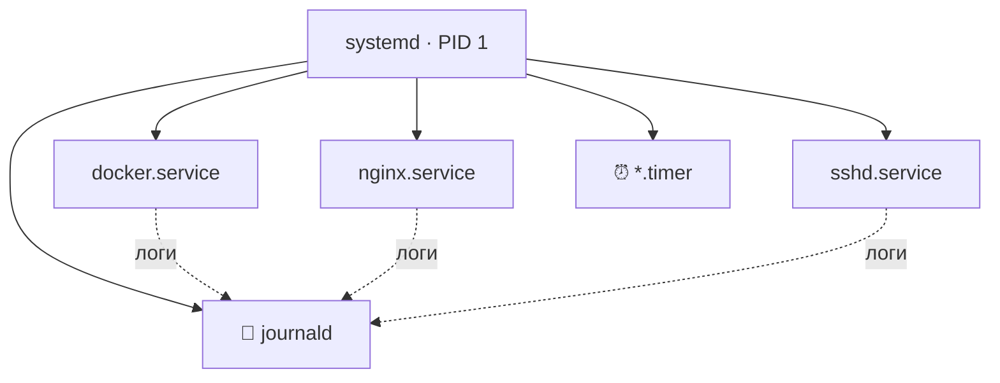
 
## 🔹 Життєвий цикл служб
`#systemd` `#services`
 
| Дія | Команда |
|---|---|
| 🟢 Стан | `systemctl status <служба>` |
| 🟡 Старт / стоп / рестарт 🆕 | `sudo systemctl start\|stop\|restart <служба>` |
| 🟡 Перечитати конфіг без зупинки 🆕 | `sudo systemctl reload <служба>` |
| 🟡 Автозапуск + старт | `sudo systemctl enable --now <служба>` |
| 🟡 Вимкнути + зупинити | `sudo systemctl disable --now <служба>` |
| 🔴 Заблокувати повністю | `sudo systemctl mask <служба>` |
| 🟡 Розблокувати | `sudo systemctl unmask <служба>` |
| 🟢 Усі служби, що впали 🆕 | `systemctl --failed` |
| 🟡 Після правки unit-файлів 🆕 | `sudo systemctl daemon-reload` |
| 🟢 Таймери 🆕 | `systemctl list-timers` |
 
## 🔹 Логи (journalctl)
`#journalctl` `#logs`
 
```bash
journalctl -u <служба> -e                 # 🟢 логи служби з кінця
journalctl -f                             # 🟢 живий потік
journalctl -b -p err                      # 🟢 помилки з поточного завантаження
journalctl -b -1                          # 🟢 попереднє завантаження (після збою!) 🆕
journalctl -k                             # 🟢 лише повідомлення ядра (dmesg) 🆕
journalctl --since "1 hour ago"           # 🟢 за останню годину 🆕
journalctl --disk-usage                   # 🟢 скільки місця займають логи 🆕
sudo journalctl --vacuum-size=500M        # 🟡 обмежити розмір логів 🆕
```
 
## 🔹 Аналіз завантаження 🆕
 
```bash
systemd-analyze                           # 🟢 загальний час старту
systemd-analyze blame                     # 🟢 найповільніші служби
systemd-analyze critical-chain            # 🟢 ланцюг, що гальмує старт
```
 
---
 
# 🛡️ 6. Мережа та безпека
 
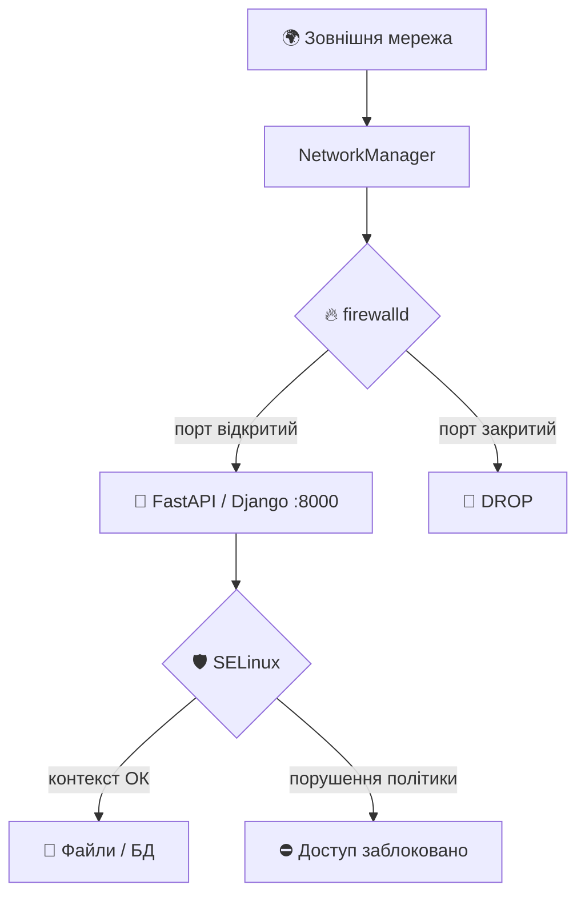
 
## 🔹 Firewalld
`#firewalld` `#ports`
 
```bash
sudo firewall-cmd --state                                   # 🟢 чи працює 🆕
sudo firewall-cmd --list-all                                # 🟢 активна зона й правила
sudo firewall-cmd --get-active-zones                        # 🟢 які зони активні 🆕
 
sudo firewall-cmd --permanent --add-port=8000/tcp           # 🟡 відкрити порт
sudo firewall-cmd --permanent --remove-port=8000/tcp        # 🟡 закрити порт
sudo firewall-cmd --permanent --add-service=http            # 🟡 відкрити сервіс за назвою 🆕
sudo firewall-cmd --reload                                  # 🟡 застосувати
```
 
> [!WARNING]
> Забув `--permanent` → правило зникне після перезавантаження. Забув `--reload` → правило не почне діяти.
> 💡 Для швидкого тесту без `--permanent` правило діє до першого `reload`.
 
## 🔹 Мережеві інтерфейси та діагностика
`#networkmanager` `#nmcli` `#network`
 
```bash
nmcli device status                       # 🟢 усі адаптери
nmcli connection show                     # 🟢 збережені профілі 🆕
sudo nmcli connection up "<профіль>"      # 🟡 перепідключити
nmcli device wifi list                    # 🟢 доступні Wi-Fi 🆕
nmcli device wifi connect "<SSID>" --ask  # 🟡 підключитись до Wi-Fi 🆕
nmcli radio                               # 🟢 стан Wi-Fi/WWAN радіо 🆕
ip -br a                                  # 🟢 коротко: інтерфейси та IP 🆕
ss -tulpn                                 # 🟢 які порти слухає система 🆕
ping -c 4 1.1.1.1                         # 🟢 є інтернет? 🆕
resolvectl status                         # 🟢 DNS-налаштування 🆕
```
 
<details>
<summary>📄 Приклад виводу <code>nmcli device status</code></summary>
```text
DEVICE     TYPE      STATE                   CONNECTION
enp4s0     ethernet  connected               Wired connection 1
wlp3s0     wifi      disconnected            --
docker0    bridge    connected (externally)  docker0
lo         loopback  unmanaged               --
```
</details>
## 🔹 SSH 🆕
`#ssh` `#security`
 
```bash
ssh-keygen -t ed25519 -C "serhii@pc"      # 🟢 згенерувати ключ
ssh-copy-id user@server                   # 🟡 додати ключ на сервер
ssh user@server                           # 🟢 підключитись
sudo systemctl enable --now sshd          # 🟡 увімкнути SSH-сервер
```
 
## 🔹 SELinux
`#selinux` `#security`
 
```bash
sestatus                                  # 🟢 режим: Enforcing / Permissive
sudo setenforce 0                         # 🟡 тимчасово Permissive (лише для діагностики!) 🆕
sudo setenforce 1                         # 🟡 повернути Enforcing 🆕
 
# 🟡 дозволити вебсервісу читати папку проекту (лікує 403)
sudo semanage fcontext -a -t httpd_sys_content_t "/шлях/проекту(/.*)?"
sudo restorecon -Rv /шлях/проекту
 
# 🟡 дозволити Nginx ходити на бекенд/БД/зовнішні API
sudo setsebool -P httpd_can_network_connect 1
```
 
### 🔍 Якщо щось «просто не працює», а помилок немає 🆕
 
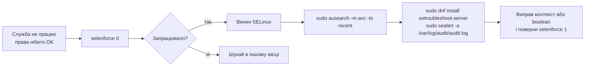
 
```bash
sudo ausearch -m avc -ts recent           # 🟢 останні відмови SELinux
ls -Z /шлях                               # 🟢 контекст файлів
ps -eZ | grep <процес>                    # 🟢 контекст процесу
getsebool -a | grep httpd                 # 🟢 boolean-и для вебсервера
```
 
> [!CAUTION]
> Ніколи не залишай `SELINUX=disabled`. Краще знайти причину і виправити контекст або boolean.
 
---
 
# 🐳 7. Docker / Podman
 
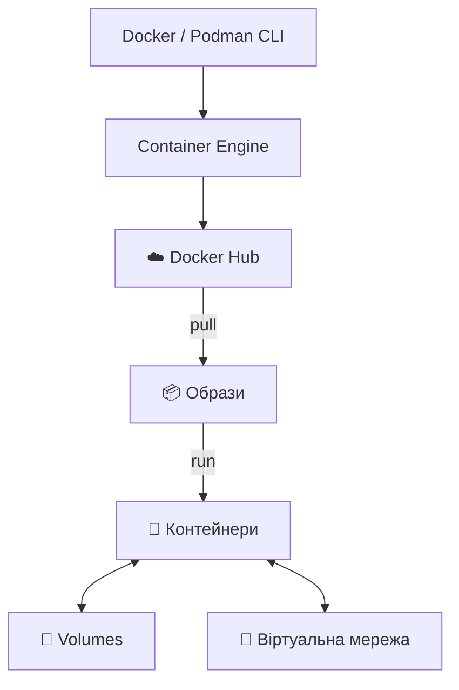
 
## 🔹 Контейнери та образи
`#docker` `#podman` `#containers`
 
```bash
docker ps -a                              # 🟢 усі контейнери
docker images                             # 🟢 локальні образи 🆕
docker pull <образ>                       # 🟡 завантажити образ 🆕
docker logs -f <ім'я>                     # 🟢 логи в реальному часі
docker exec -it <ім'я> bash               # 🟡 зайти всередину контейнера 🆕
docker stats                              # 🟢 CPU/RAM контейнерів 🆕
docker stop <ім'я> && docker rm <ім'я>    # 🟡 зупинити і видалити
```
 
```bash
# 🟡 PostgreSQL для розробки (з томом, щоб дані не зникли)
docker run -d --name pg-dev \
  -p 5432:5432 \
  -e POSTGRES_PASSWORD=<пароль> \
  -e POSTGRES_DB=mydb \
  -v pgdata:/var/lib/postgresql/data \
  postgres:15-alpine
```
 
> [!WARNING]
> Без `-v` дані БД живуть лише всередині контейнера й зникають разом із ним. Реальні паролі не залишай у історії команд і не коміть у git.
 
<details>
<summary>📄 Приклад виводу <code>docker ps -a</code></summary>
```text
CONTAINER ID   IMAGE                COMMAND                  STATUS                  PORTS                    NAMES
a1b2c3d4e5f6   postgres:15-alpine   "docker-entrypoint.s…"   Up 2 minutes            0.0.0.0:5432->5432/tcp   pg-dev
9876543210ab   redis:alpine         "docker-entrypoint.s…"   Exited (0) 4 days ago                            redis-cache
```
</details>
## 🔹 Docker Compose 🆕
`#compose`
 
```bash
docker compose up -d                      # 🟡 підняти весь стек
docker compose ps                         # 🟢 стан сервісів
docker compose logs -f <сервіс>           # 🟢 логи сервісу
docker compose down                       # 🟡 зупинити й видалити контейнери
docker compose down -v                    # 🔴 + видалити томи (дані БД!)
docker compose up -d --build              # 🟡 перебудувати образи й запустити
```
 
## 🔹 Особливості Fedora 🆕
 
```bash
sudo systemctl enable --now docker        # 🟡 запустити Docker-демон
sudo usermod -aG docker $USER             # 🟡 працювати без sudo (потрібен перелогін)
```
 
> 💡 У Fedora «з коробки» є **Podman**: безdemonний і rootless. Команди майже ті самі (`podman ps`, `podman run`, `podman logs`). Якщо SELinux блокує доступ до змонтованої папки, додай до тому суфікс `:Z`, наприклад `-v ./data:/data:Z`.
 
## 🔹 Очищення середовища
`#cleanup` `#prune`
 
| Рівень | Команда | Що видаляє |
|---|---|---|
| 🟡 М'яко | `docker image prune` | образи `<none>:<none>` |
| 🟡 Помірно 🆕 | `docker container prune` | зупинені контейнери |
| 🟢 Статистика 🆕 | `docker system df` | скільки місця займає Docker |
| 🔴 Агресивно | `docker system prune -a --volumes` | усе невикористане, **включно з томами** |
 
```bash
docker stop $(docker ps -q)               # 🟡 зупинити всі активні контейнери
```
 
> [!CAUTION]
> `--volumes` назавжди видаляє томи з даними. Спершу переконайся, що БД не потрібні.
 
---
 
# 📊 8. Моніторинг: диски, пам'ять, процеси 🆕
 
`#monitoring` `#disk` `#memory` `#process`
 
## 🔹 Диски та місце
 
```bash
df -h                                     # 🟢 вільне місце по розділах
lsblk -f                                  # 🟢 диски, розділи, ФС, UUID
du -sh * | sort -h                        # 🟢 що займає місце у поточній папці
sudo du -xh / --max-depth=1 | sort -h     # 🟢 найбільші папки на кореневому розділі
sudo smartctl -a /dev/nvme0n1             # 🟢 здоров'я диска (пакет smartmontools)
```
 
## 🔹 Пам'ять і процесор
 
```bash
free -h                                   # 🟢 RAM та swap
htop                                      # 🟢 інтерактивний монітор (dnf install htop)
top                                       # 🟢 вбудований монітор
uptime                                    # 🟢 час роботи та навантаження
sensors                                   # 🟢 температури (пакет lm_sensors)
```
 
## 🔹 Процеси
 
```bash
ps aux | grep <назва>                     # 🟢 знайти процес
pgrep -a <назва>                          # 🟢 PID за назвою
kill <PID>                                # 🟡 коректно завершити
kill -9 <PID>                             # 🔴 примусово
sudo lsof -i :8000                        # 🟢 хто тримає порт 8000
```
 
## 🔹 Інформація про залізо
 
```bash
hostnamectl                               # 🟢 ОС, ядро, хост
lscpu                                     # 🟢 процесор
lspci -k | grep -A3 -i vga                # 🟢 відеокарта та який драйвер її тримає
lsusb                                     # 🟢 USB-пристрої
sudo dmesg -T | tail -50                  # 🟢 останні повідомлення ядра
```
 
---
 
# 👤 9. Користувачі та права 🆕
 
`#users` `#permissions`
 
```bash
whoami                                    # 🟢 хто я
id                                        # 🟢 мої групи
sudo useradd -m -G wheel <ім'я>           # 🟡 новий користувач з правом sudo
sudo passwd <ім'я>                        # 🟡 задати пароль
sudo usermod -aG <група> <ім'я>           # 🟡 додати до групи
sudo userdel -r <ім'я>                    # 🔴 видалити з домашньою папкою
```
 
```bash
ls -l                                     # 🟢 права
chmod 640 файл                            # 🟡 власник rw, група r, інші нічого
chmod +x скрипт.sh                        # 🟡 зробити виконуваним
chown user:group файл                     # 🟡 змінити власника
```
 
| Права | Значення | Типове застосування |
|:---:|---|---|
| `600` | власник читає/пише | ключі, `.env` |
| `644` | власник пише, всі читають | звичайні файли |
| `755` | власник усе, інші читають/виконують | скрипти, папки |
| `700` | лише власник | приватні папки |
 
---
 
# 🐍 10. Середовище розробки Python 🆕
 
`#python` `#venv` `#backend`
 
```bash
python3 --version                         # 🟢 версія
python3 -m venv .venv                     # 🟡 створити віртуальне оточення
source .venv/bin/activate                 # 🟢 активувати
pip install -r requirements.txt           # 🟡 залежності
pip freeze > requirements.txt             # 🟡 зафіксувати залежності
deactivate                                # 🟢 вийти з оточення
```
 
```bash
uvicorn main:app --reload --port 8000     # 🟢 FastAPI для розробки
python manage.py runserver                # 🟢 Django для розробки
python manage.py migrate                  # 🟡 застосувати міграції
```
 
> 💡 Хочеш звернутись до dev-сервера з іншого пристрою в мережі: запускай з `--host 0.0.0.0` і відкрий порт через firewalld (див. розділ 6). Не залишай такий порт відкритим назавжди.
 
---
 
# 🚑 11. SOS-сценарії
 
## 🔥 Після оновлення чорний екран або немає NVIDIA
 
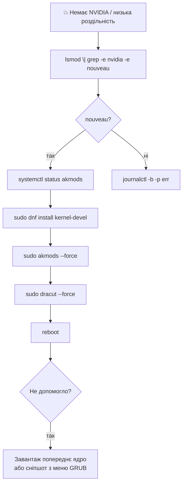
 
## 📸 Система зламана після оновлення
 
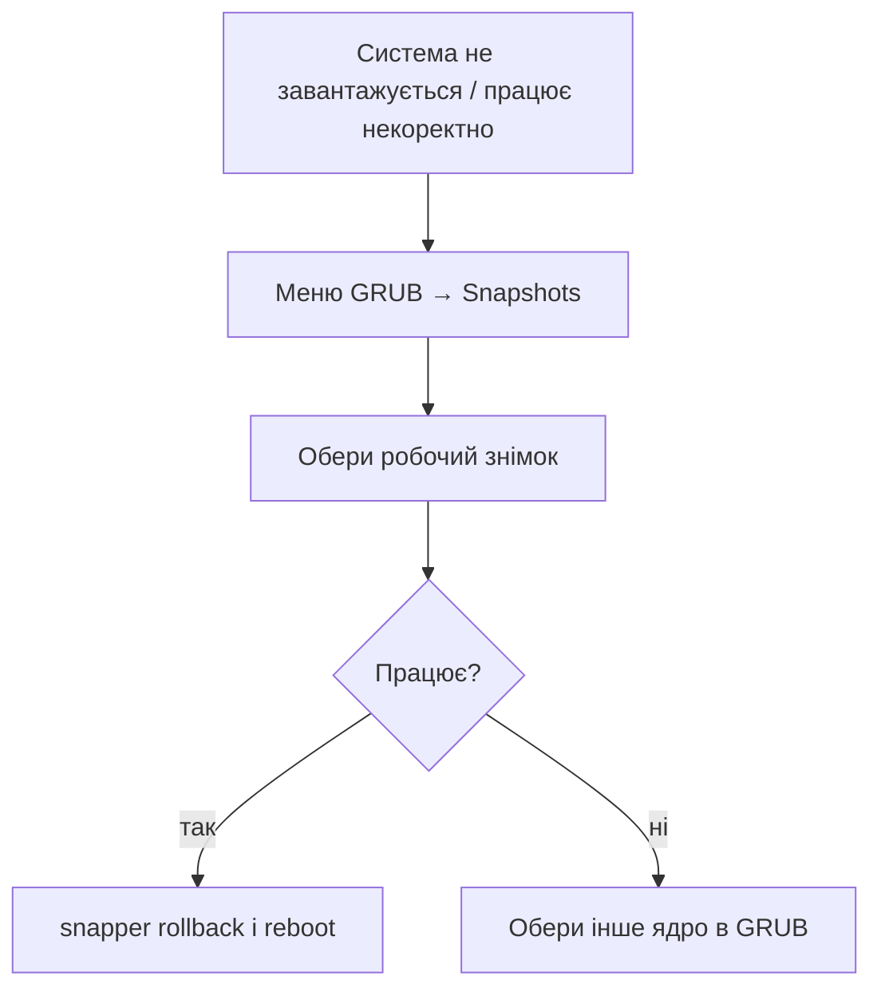
 
## 💽 «No space left on device», хоча місце є
 
```bash
sudo btrfs filesystem usage /             # 1. подивитись, скільки нерозмічених чанків
sudo snapper -c root cleanup number       # 2. прибрати зайві сніпшоти
sudo btrfs balance start -dusage=10 /     # 3. звільнити напівпорожні чанки
docker system df                          # 4. перевірити, чи не зʼїв місце Docker
```
 
## 🌐 Сервіс не відповідає ззовні
 
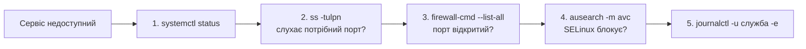
 
## 📡 Wi-Fi чи клавіатура відвалились 🆕
 
```bash
journalctl -b -1 -p warning               # 🟢 що писало ядро перед збоєм (попереднє завантаження)
journalctl -k | grep -i -e rfkill -e iwlwifi -e firmware    # 🟢 помилки Wi-Fi та прошивки
rfkill list                               # 🟢 чи не заблоковане радіо програмно/апаратно
sudo dnf upgrade --refresh                # 🟡 свіжі прошивки та ядро
```
 
---
 
# 🏷️ Індекс тегів
 
| Тег | Розділ |
|---|---|
| `#dnf` `#packages` `#repos` `#upgrade` | 📦 Пакети |
| `#flatpak` | 📚 Flatpak |
| `#btrfs` `#snapper` `#snapshots` `#scrub` `#balance` | 💾 Btrfs |
| `#kernel` `#akmods` `#dracut` `#nvidia` `#grub` | 🧠 Ядро |
| `#systemd` `#services` `#journalctl` | ⚙️ Systemd |
| `#firewalld` `#ports` `#nmcli` `#ssh` `#selinux` | 🛡️ Мережа |
| `#docker` `#podman` `#compose` `#prune` | 🐳 Контейнери |
| `#monitoring` `#disk` `#process` | 📊 Моніторинг |
| `#users` `#permissions` | 👤 Користувачі |
| `#python` `#venv` | 🐍 Python |
 
---
 
<div align="center">
**🧰 Порада:** тримай цей файл у git-репозиторії, і кожна нова корисна команда стане твоєю базою знань.
 
*Зроби сніпшот. Перевір двічі. Тоді тисни Enter.* 📸