<div align="center">

# 🐧 FEDORA LINUX · ADMIN CHEAT SHEET

**Fedora 44 · KDE Plasma · Btrfs + Snapper · NVIDIA · Docker/Podman**

*Personal reference: find → copy → run*


</div>

---

## 🧭 How to Use

| Marker | Meaning |
|:---:|---|
| 🟢 | Safe, run without a second thought |
| 🟡 | Changes the system, double-check before running |
| 🔴 | Dangerous / irreversible, take a snapshot first |
| 💡 | Useful tip |
| 🆕 | Added to your version |

> [!TIP]
> Search for a command with `Ctrl+F` by tag, e.g. `#nvidia`, `#snapper`, `#firewalld`.
> `<...>` in commands means you must substitute your own value.

---

## 📑 Table of Contents

1. [⚡ Top 15: Everyday Commands](#-top-15-everyday-commands)
2. [📦 Packages and Updates (DNF5)](#-1-packages-and-updates-dnf5)
3. [📚 Flatpak 🆕](#-2-flatpak-)
4. [💾 Btrfs + Snapper](#-3-btrfs--snapper)
5. [🧠 Kernel, NVIDIA, GRUB](#-4-kernel-nvidia-grub)
6. [⚙️ Systemd](#️-5-systemd)
7. [🛡️ Network and Security](#️-6-network-and-security)
8. [🐳 Docker / Podman](#-7-docker--podman)
9. [📊 Monitoring: Disks, Memory, Processes 🆕](#-8-monitoring-disks-memory-processes-)
10. [👤 Users and Permissions 🆕](#-9-users-and-permissions-)
11. [🐍 Python Dev Environment 🆕](#-10-python-dev-environment-)
12. [🚑 SOS Scenarios](#-11-sos-scenarios)
13. [🏷️ Tag Index](#️-tag-index)

---

## 🗺️ System Map

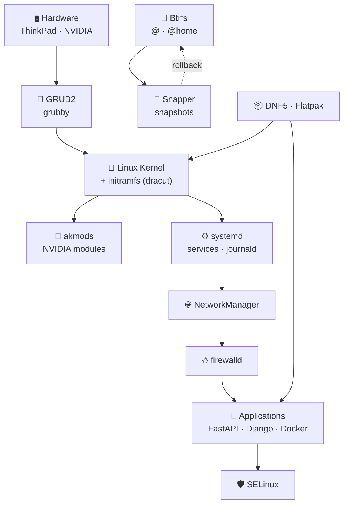

---

## ⚡ Top 15: Everyday Commands

```bash
sudo dnf upgrade --refresh              # 🟡 update everything
dnf search <name>                       # 🟢 find a package
sudo dnf install <package>              # 🟡 install
sudo dnf remove <package>               # 🟡 remove
sudo snapper -c root create -d "Before changes"   # 🟢 snapshot
snapper ls                              # 🟢 list snapshots
systemctl status <service>              # 🟢 service status
sudo systemctl enable --now <service>   # 🟡 autostart + start now
journalctl -b -p err                    # 🟢 errors from the current boot
sudo firewall-cmd --list-all            # 🟢 firewall rules
df -h                                   # 🟢 free space
sudo btrfs filesystem usage /           # 🟢 real space usage on Btrfs
docker ps -a                            # 🟢 all containers
sudo dnf history                        # 🟢 transaction history
sestatus                                # 🟢 SELinux mode
```

> [!IMPORTANT]
> **Golden rule before a kernel update, driver update, or a big `dnf upgrade`:** take a snapshot. That's 3 seconds versus 3 hours of recovery.

---

# 📦 1. Packages and Updates (DNF5)

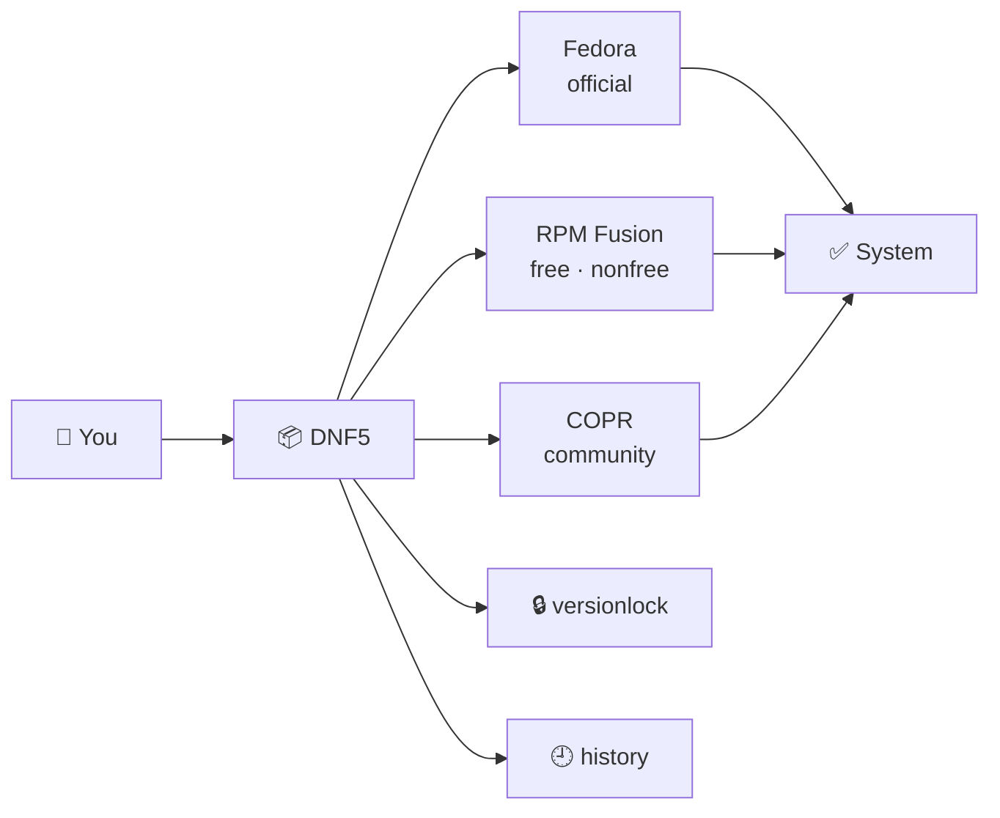

## 🔹 Basic Operations
`#dnf` `#packages` `#update`

| Action | Command |
|---|---|
| 🟡 Update the system | `sudo dnf upgrade --refresh` |
| 🟢 Search for a package | `dnf search <keyword>` |
| 🟢 Package info | `dnf info <package>` |
| 🟡 Install | `sudo dnf install <package>` |
| 🟡 Remove | `sudo dnf remove <package>` |
| 🟡 Remove orphaned dependencies 🆕 | `sudo dnf autoremove` |
| 🟡 Reinstall 🆕 | `sudo dnf reinstall <package>` |
| 🟡 Downgrade a package version 🆕 | `sudo dnf downgrade <package>` |
| 🟢 Which package provides a file/command? 🆕 | `dnf provides */<file_name>` |
| 🟢 List installed packages 🆕 | `dnf list --installed` |
| 🟢 Are updates available? 🆕 | `dnf check-upgrade` |
| 🟡 Clean the cache 🆕 | `sudo dnf clean all` |
| 🟡 Install a package group 🆕 | `sudo dnf group install development-tools` |
| 🟢 Is a reboot needed? 🆕 | `sudo dnf needs-restarting -r` |

> 💡 The `--refresh` flag forces a metadata refresh. Useful after adding a repository.

## 🔹 Repositories: RPM Fusion and COPR
`#repos` `#rpmfusion` `#copr`

```bash
# 🟢 Enabled repositories
dnf repolist

# 🟡 Enable RPM Fusion (free + nonfree) 🆕
sudo dnf install \
  https://mirrors.rpmfusion.org/free/fedora/rpmfusion-free-release-$(rpm -E %fedora).noarch.rpm \
  https://mirrors.rpmfusion.org/nonfree/fedora/rpmfusion-nonfree-release-$(rpm -E %fedora).noarch.rpm

# 🟡 Enable a COPR repository
sudo dnf copr enable <user>/<repository>

# 🟡 Disable a COPR repository 🆕
sudo dnf copr disable <user>/<repository>
```

<details>
<summary>📄 Example output of <code>dnf repolist</code></summary>

```text
repo id                    repo name
fedora                     Fedora 44 - x86_64
fedora-cisco-openh264      Fedora 44 openh264 (From Cisco) - x86_64
rpmfusion-free             RPM Fusion for Fedora 44 - Free
rpmfusion-nonfree          RPM Fusion for Fedora 44 - Nonfree
```
</details>

> [!WARNING]
> COPR repositories are community builds with no guarantees. Only enable what you trust, and keep track of what you install.

## 🔹 Versionlock and History
`#versionlock` `#history`

```bash
sudo dnf versionlock add <package>      # 🟡 freeze a version (kernel, akmod-nvidia)
dnf versionlock list                    # 🟢 what is frozen
sudo dnf versionlock delete <package>   # 🟡 unfreeze

dnf history                             # 🟢 numbered list of transactions
dnf history info <number>               # 🟢 what exactly a transaction changed 🆕
sudo dnf history undo <number>          # 🔴 undo a transaction
```

> 💡 If the versionlock plugin is missing: `sudo dnf install python3-dnf-plugin-versionlock` (DNF4) or `sudo dnf install dnf5-plugins` (DNF5).

## 🔹 Upgrading to a New Fedora Release 🆕
`#upgrade` `#release`


```bash
sudo snapper -c root create -d "Before Fedora upgrade"
sudo dnf upgrade --refresh
sudo reboot
sudo dnf system-upgrade download --releasever=<N>
sudo dnf offline reboot
```

> [!NOTE]
> Check in advance that the NVIDIA driver is compatible with the new release and which COPR repositories you have enabled: they are the most common cause of broken upgrades.

---

# 📚 2. Flatpak 🆕

`#flatpak` `#apps`

```bash
flatpak remotes                          # 🟢 configured remotes
flatpak search <name>                    # 🟢 search
flatpak install flathub <app.id>         # 🟡 install
flatpak list                             # 🟢 installed apps
flatpak update                           # 🟡 update everything
flatpak uninstall <app.id>               # 🟡 uninstall
flatpak uninstall --unused               # 🟡 remove unused runtimes
flatpak run <app.id>                     # 🟢 launch from the terminal
```

---

# 💾 3. Btrfs + Snapper

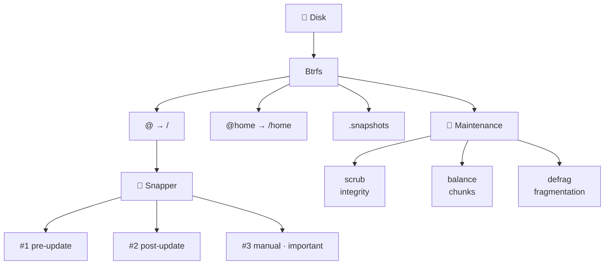

## 🔹 Subvolumes
`#btrfs` `#subvolumes`

```bash
sudo btrfs subvolume list /                  # 🟢 all subvolumes with IDs
sudo btrfs subvolume create /path/to/subvolume   # 🟡 create
sudo btrfs subvolume delete /path/to/subvolume   # 🔴 delete along with its data
sudo btrfs subvolume show /                  # 🟢 subvolume details 🆕
```

> 💡 Databases (PostgreSQL) and the Docker cache are better placed in a separate subvolume so they don't end up in snapshots and bloat them.
> For such directories `chattr +C <folder>` (disable Copy-on-Write) is also useful, **before** creating any files inside.

## 🔹 Snapper Snapshots
`#snapper` `#snapshots` `#recovery`

| Action | Command |
|---|---|
| 🟢 List | `snapper ls` |
| 🟢 Create a manual snapshot | `sudo snapper -c root create --type single -d "Description"` |
| 🟢 What changed between snapshots 🆕 | `sudo snapper -c root status 5..8` |
| 🟢 Diff of a specific file 🆕 | `sudo snapper -c root diff 5..8 /etc/fstab` |
| 🟡 Restore files | `sudo snapper -c root undochange 5..8` |
| 🔴 Full rollback | `sudo snapper --ambit classic rollback <number>` |
| 🔴 Delete a snapshot 🆕 | `sudo snapper -c root delete <number>` |
| 🟡 Mark as important | `sudo snapper modify -u important=yes <number>` |

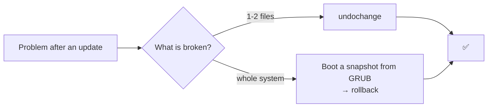

> [!WARNING]
> **Rollback** creates a new subvolume and makes it the root. Reboot the PC afterwards. The command only works correctly with a Snapper-compatible subvolume layout. If the system was installed with the standard Fedora layout, it is more reliable to roll back by booting a snapshot from the GRUB menu.

## 🔹 Limits and Cleanup
`#snapper` `#cleanup`

```bash
sudo nano /etc/snapper/configs/root
# NUMBER_LIMIT="10"
# NUMBER_LIMIT_IMPORTANT="0"

sudo snapper -c root cleanup number      # 🟡 force cleanup by number limit
sudo snapper -c root cleanup timeline    # 🟡 cleanup by timeline
```

## 🔹 Space Maintenance
`#maintenance` `#scrub` `#balance`

| Operation | Command | Why |
|---|---|---|
| 🟢 Scrub | `sudo btrfs scrub start /` | verifies checksums, detects bit rot |
| 🟢 Scrub status | `sudo btrfs scrub status /` | progress and number of errors |
| 🟡 Balance | `sudo btrfs balance start -dusage=10 /` | frees half-empty chunks, fixes false "No space left" |
| 🟡 Defrag | `sudo btrfs filesystem defragment -r -v /path` | defragmentation (don't run on `/` without a reason) |
| 🟢 Real space used 🆕 | `sudo btrfs filesystem usage /` | more accurate than `df` |
| 🟢 Error counters 🆕 | `sudo btrfs device stats /` | read/write/corruption errors |

> [!CAUTION]
> Defrag breaks shared blocks (reflinks) between snapshots, so disk usage can jump sharply. It is usually not needed on SSDs.

---

# 🧠 4. Kernel, NVIDIA, GRUB

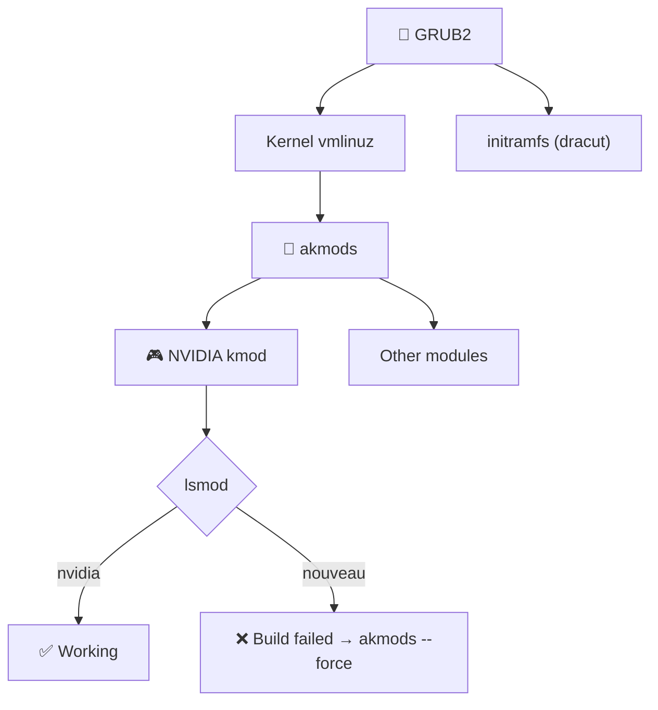

## 🔹 Modules: akmods and dracut
`#kernel` `#akmods` `#dracut`

```bash
sudo akmods --force                       # 🟡 rebuild modules for the current kernel
sudo dracut --force                       # 🟡 regenerate initramfs
lsmod | grep -e nvidia -e nouveau         # 🟢 which driver is active
uname -r                                  # 🟢 current kernel version 🆕
rpm -q kernel                             # 🟢 installed kernels 🆕
```

## 🔹 NVIDIA: Checks and Diagnostics
`#nvidia` `#gpu` `#troubleshooting`

```bash
modinfo -F version nvidia                 # 🟢 version of the built module
systemctl status akmods                   # 🟢 build log
nvidia-smi                                # 🟢 GPU state, temperature, processes 🆕
rpm -qa | grep -i nvidia                  # 🟢 which NVIDIA packages are installed 🆕
sudo dnf install kernel-devel             # 🟡 headers, akmods can't build the module without them 🆕
```

> [!TIP]
> **Safe NVIDIA update rule:** after a `dnf upgrade` that touches the kernel or the driver, **don't reboot right away**. Wait 3-5 minutes (while `akmods` builds the module) and check `modinfo -F version nvidia`.

> [!NOTE]
> If **Secure Boot** is enabled, an unsigned NVIDIA module will not load. Check with `mokutil --sb-state`. Signing uses `kmodgenkey` + `mokutil --import`.

## 🔹 GRUB2 and Kernel Parameters
`#grub` `#bootloader`

```bash
sudo grubby --info=ALL                                    # 🟢 all kernels and their arguments
sudo grubby --default-kernel                              # 🟢 default kernel 🆕
sudo grubby --update-kernel=ALL --args="nvidia-drm.modeset=1"   # 🟡 add a parameter
sudo grubby --update-kernel=ALL --remove-args="nvidia-drm.modeset=1"   # 🟡 remove it
sudo grub2-mkconfig -o /boot/grub2/grub.cfg               # 🟡 regenerate the config
```

> 💡 `nvidia-drm.modeset=1` is required for Wayland (KDE Plasma) on NVIDIA.

---

# ⚙️ 5. Systemd


## 🔹 Service Lifecycle
`#systemd` `#services`

| Action | Command |
|---|---|
| 🟢 Status | `systemctl status <service>` |
| 🟡 Start / stop / restart 🆕 | `sudo systemctl start\|stop\|restart <service>` |
| 🟡 Reload config without stopping 🆕 | `sudo systemctl reload <service>` |
| 🟡 Autostart + start now | `sudo systemctl enable --now <service>` |
| 🟡 Disable + stop | `sudo systemctl disable --now <service>` |
| 🔴 Block completely | `sudo systemctl mask <service>` |
| 🟡 Unblock | `sudo systemctl unmask <service>` |
| 🟢 All failed services 🆕 | `systemctl --failed` |
| 🟡 After editing unit files 🆕 | `sudo systemctl daemon-reload` |
| 🟢 Timers 🆕 | `systemctl list-timers` |

## 🔹 Logs (journalctl)
`#journalctl` `#logs`

```bash
journalctl -u <service> -e                # 🟢 service logs from the end
journalctl -f                             # 🟢 live stream
journalctl -b -p err                      # 🟢 errors from the current boot
journalctl -b -1                          # 🟢 previous boot (after a crash!) 🆕
journalctl -k                             # 🟢 kernel messages only (dmesg) 🆕
journalctl --since "1 hour ago"           # 🟢 for the last hour 🆕
journalctl --disk-usage                   # 🟢 how much space logs take 🆕
sudo journalctl --vacuum-size=500M        # 🟡 limit log size 🆕
```

## 🔹 Boot Analysis 🆕

```bash
systemd-analyze                           # 🟢 total boot time
systemd-analyze blame                     # 🟢 slowest services
systemd-analyze critical-chain            # 🟢 the chain slowing down boot
```

---

# 🛡️ 6. Network and Security

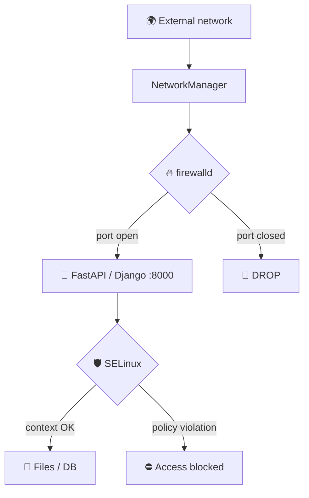

## 🔹 Firewalld
`#firewalld` `#ports`

```bash
sudo firewall-cmd --state                                   # 🟢 is it running 🆕
sudo firewall-cmd --list-all                                # 🟢 active zone and rules
sudo firewall-cmd --get-active-zones                        # 🟢 which zones are active 🆕

sudo firewall-cmd --permanent --add-port=8000/tcp           # 🟡 open a port
sudo firewall-cmd --permanent --remove-port=8000/tcp        # 🟡 close a port
sudo firewall-cmd --permanent --add-service=http            # 🟡 open a service by name 🆕
sudo firewall-cmd --reload                                  # 🟡 apply
```

> [!WARNING]
> Forgot `--permanent` → the rule disappears after a reboot. Forgot `--reload` → the rule doesn't take effect.
> 💡 For a quick test without `--permanent`, the rule lasts until the first `reload`.

## 🔹 Network Interfaces and Diagnostics
`#networkmanager` `#nmcli` `#network`

```bash
nmcli device status                       # 🟢 all adapters
nmcli connection show                     # 🟢 saved profiles 🆕
sudo nmcli connection up "<profile>"      # 🟡 reconnect
nmcli device wifi list                    # 🟢 available Wi-Fi networks 🆕
nmcli device wifi connect "<SSID>" --ask  # 🟡 connect to Wi-Fi 🆕
nmcli radio                               # 🟢 Wi-Fi/WWAN radio state 🆕
ip -br a                                  # 🟢 brief: interfaces and IPs 🆕
ss -tulpn                                 # 🟢 which ports the system is listening on 🆕
ping -c 4 1.1.1.1                         # 🟢 is the internet up? 🆕
resolvectl status                         # 🟢 DNS settings 🆕
```

<details>
<summary>📄 Example output of <code>nmcli device status</code></summary>

```text
DEVICE     TYPE      STATE                   CONNECTION
enp4s0     ethernet  connected               Wired connection 1
wlp3s0     wifi      disconnected            --
docker0    bridge    connected (externally)  docker0
lo         loopback  unmanaged               --
```
</details>

## 🔹 SSH 🆕
`#ssh` `#security`

```bash
ssh-keygen -t ed25519 -C "serhii@pc"      # 🟢 generate a key
ssh-copy-id user@server                   # 🟡 add the key to a server
ssh user@server                           # 🟢 connect
sudo systemctl enable --now sshd          # 🟡 enable the SSH server
```

## 🔹 SELinux
`#selinux` `#security`

```bash
sestatus                                  # 🟢 mode: Enforcing / Permissive
sudo setenforce 0                         # 🟡 temporarily Permissive (diagnostics only!) 🆕
sudo setenforce 1                         # 🟡 back to Enforcing 🆕

# 🟡 allow a web service to read the project folder (fixes 403)
sudo semanage fcontext -a -t httpd_sys_content_t "/path/to/project(/.*)?"
sudo restorecon -Rv /path/to/project

# 🟡 allow Nginx to connect to a backend/DB/external APIs
sudo setsebool -P httpd_can_network_connect 1
```

### 🔍 When something "just doesn't work" and there are no errors 🆕

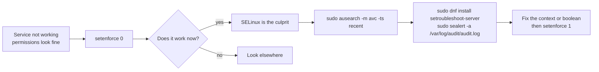

```bash
sudo ausearch -m avc -ts recent           # 🟢 recent SELinux denials
ls -Z /path                               # 🟢 file contexts
ps -eZ | grep <process>                   # 🟢 process context
getsebool -a | grep httpd                 # 🟢 web server booleans
```

> [!CAUTION]
> Never leave `SELINUX=disabled`. It is better to find the cause and fix the context or boolean.

---

# 🐳 7. Docker / Podman

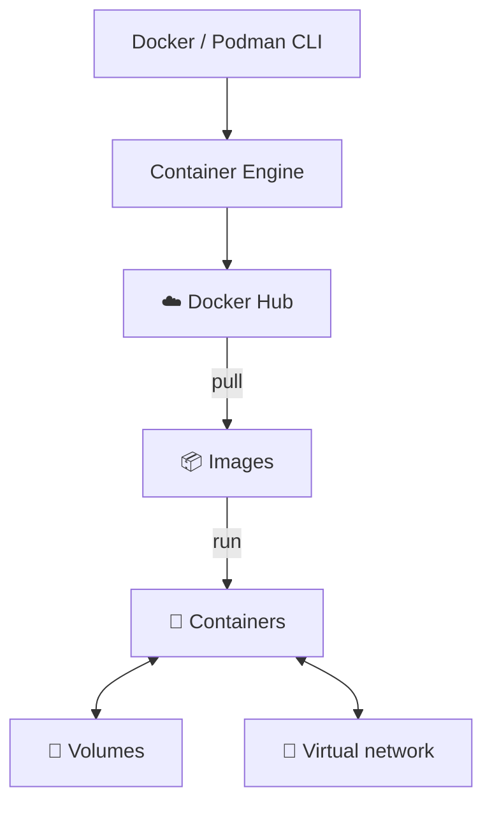

## 🔹 Containers and Images
`#docker` `#podman` `#containers`

```bash
docker ps -a                              # 🟢 all containers
docker images                             # 🟢 local images 🆕
docker pull <image>                       # 🟡 download an image 🆕
docker logs -f <name>                     # 🟢 live logs
docker exec -it <name> bash               # 🟡 get a shell inside a container 🆕
docker stats                              # 🟢 container CPU/RAM 🆕
docker stop <name> && docker rm <name>    # 🟡 stop and remove
```

```bash
# 🟡 PostgreSQL for development (with a volume so data isn't lost)
docker run -d --name pg-dev \
  -p 5432:5432 \
  -e POSTGRES_PASSWORD=<password> \
  -e POSTGRES_DB=mydb \
  -v pgdata:/var/lib/postgresql/data \
  postgres:15-alpine
```

> [!WARNING]
> Without `-v`, DB data lives only inside the container and disappears with it. Don't leave real passwords in your shell history and don't commit them to git.

<details>
<summary>📄 Example output of <code>docker ps -a</code></summary>

```text
CONTAINER ID   IMAGE                COMMAND                  STATUS                  PORTS                    NAMES
a1b2c3d4e5f6   postgres:15-alpine   "docker-entrypoint.s…"   Up 2 minutes            0.0.0.0:5432->5432/tcp   pg-dev
9876543210ab   redis:alpine         "docker-entrypoint.s…"   Exited (0) 4 days ago                            redis-cache
```
</details>

## 🔹 Docker Compose 🆕
`#compose`

```bash
docker compose up -d                      # 🟡 bring up the whole stack
docker compose ps                         # 🟢 service status
docker compose logs -f <service>          # 🟢 service logs
docker compose down                       # 🟡 stop and remove containers
docker compose down -v                    # 🔴 + remove volumes (DB data!)
docker compose up -d --build              # 🟡 rebuild images and start
```

## 🔹 Fedora Specifics 🆕

```bash
sudo systemctl enable --now docker        # 🟡 start the Docker daemon
sudo usermod -aG docker $USER             # 🟡 use Docker without sudo (re-login required)
```

> 💡 Fedora ships with **Podman** out of the box: daemonless and rootless. The commands are almost identical (`podman ps`, `podman run`, `podman logs`). If SELinux blocks access to a mounted folder, add the `:Z` suffix to the volume, e.g. `-v ./data:/data:Z`.

## 🔹 Cleaning Up the Environment
`#cleanup` `#prune`

| Level | Command | What it removes |
|---|---|---|
| 🟡 Gentle | `docker image prune` | `<none>:<none>` images |
| 🟡 Moderate 🆕 | `docker container prune` | stopped containers |
| 🟢 Statistics 🆕 | `docker system df` | how much space Docker uses |
| 🔴 Aggressive | `docker system prune -a --volumes` | everything unused, **including volumes** |

```bash
docker stop $(docker ps -q)               # 🟡 stop all running containers
```

> [!CAUTION]
> `--volumes` permanently deletes volumes with data. First make sure you don't need the databases.

---

# 📊 8. Monitoring: Disks, Memory, Processes 🆕

`#monitoring` `#disk` `#memory` `#process`

## 🔹 Disks and Space

```bash
df -h                                     # 🟢 free space per partition
lsblk -f                                  # 🟢 disks, partitions, filesystems, UUIDs
du -sh * | sort -h                        # 🟢 what takes space in the current folder
sudo du -xh / --max-depth=1 | sort -h     # 🟢 biggest folders on the root partition
sudo smartctl -a /dev/nvme0n1             # 🟢 disk health (smartmontools package)
```

## 🔹 Memory and CPU

```bash
free -h                                   # 🟢 RAM and swap
htop                                      # 🟢 interactive monitor (dnf install htop)
top                                       # 🟢 built-in monitor
uptime                                    # 🟢 uptime and load
sensors                                   # 🟢 temperatures (lm_sensors package)
```

## 🔹 Processes

```bash
ps aux | grep <name>                      # 🟢 find a process
pgrep -a <name>                           # 🟢 PID by name
kill <PID>                                # 🟡 terminate gracefully
kill -9 <PID>                             # 🔴 force kill
sudo lsof -i :8000                        # 🟢 who is holding port 8000
```

## 🔹 Hardware Information

```bash
hostnamectl                               # 🟢 OS, kernel, host
lscpu                                     # 🟢 CPU
lspci -k | grep -A3 -i vga                # 🟢 GPU and which driver holds it
lsusb                                     # 🟢 USB devices
sudo dmesg -T | tail -50                  # 🟢 latest kernel messages
```

---

# 👤 9. Users and Permissions 🆕

`#users` `#permissions`

```bash
whoami                                    # 🟢 who am I
id                                        # 🟢 my groups
sudo useradd -m -G wheel <name>           # 🟡 new user with sudo rights
sudo passwd <name>                        # 🟡 set a password
sudo usermod -aG <group> <name>           # 🟡 add to a group
sudo userdel -r <name>                    # 🔴 delete along with the home folder
```

```bash
ls -l                                     # 🟢 permissions
chmod 640 file                            # 🟡 owner rw, group r, others nothing
chmod +x script.sh                        # 🟡 make executable
chown user:group file                     # 🟡 change owner
```

| Mode | Meaning | Typical use |
|:---:|---|---|
| `600` | owner reads/writes | keys, `.env` |
| `644` | owner writes, everyone reads | regular files |
| `755` | owner everything, others read/execute | scripts, folders |
| `700` | owner only | private folders |

---

# 🐍 10. Python Dev Environment 🆕

`#python` `#venv` `#backend`

```bash
python3 --version                         # 🟢 version
python3 -m venv .venv                     # 🟡 create a virtual environment
source .venv/bin/activate                 # 🟢 activate
pip install -r requirements.txt           # 🟡 install dependencies
pip freeze > requirements.txt             # 🟡 pin dependencies
deactivate                                # 🟢 leave the environment
```

```bash
uvicorn main:app --reload --port 8000     # 🟢 FastAPI dev server
python manage.py runserver                # 🟢 Django dev server
python manage.py migrate                  # 🟡 apply migrations
```

> 💡 Want to reach the dev server from another device on the network: run it with `--host 0.0.0.0` and open the port via firewalld (see section 6). Don't leave such a port open permanently.

---

# 🚑 11. SOS Scenarios

## 🔥 Black screen or no NVIDIA after an update

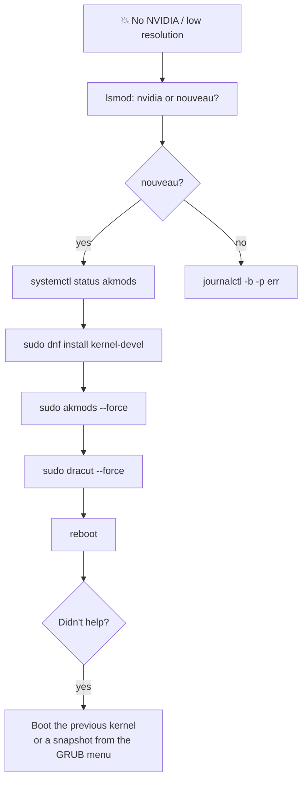

## 📸 System broken after an update

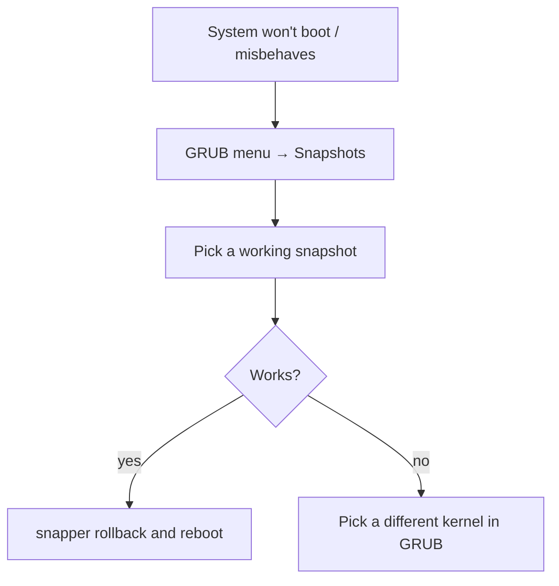

## 💽 "No space left on device" even though there is space

```bash
sudo btrfs filesystem usage /             # 1. check how many unallocated chunks remain
sudo snapper -c root cleanup number       # 2. remove excess snapshots
sudo btrfs balance start -dusage=10 /     # 3. free half-empty chunks
docker system df                          # 4. check whether Docker ate the space
```

## 🌐 Service not reachable from outside

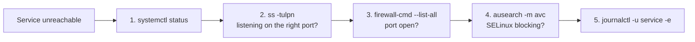

## 📡 Wi-Fi or keyboard dropped out 🆕

```bash
journalctl -b -1 -p warning               # 🟢 what the kernel logged before the crash (previous boot)
journalctl -k | grep -i -e rfkill -e iwlwifi -e firmware    # 🟢 Wi-Fi and firmware errors
rfkill list                               # 🟢 is the radio blocked in software/hardware
sudo dnf upgrade --refresh                # 🟡 fresh firmware and kernel
```

---

# 🏷️ Tag Index

| Tag | Section |
|---|---|
| `#dnf` `#packages` `#repos` `#upgrade` | 📦 Packages |
| `#flatpak` | 📚 Flatpak |
| `#btrfs` `#snapper` `#snapshots` `#scrub` `#balance` | 💾 Btrfs |
| `#kernel` `#akmods` `#dracut` `#nvidia` `#grub` | 🧠 Kernel |
| `#systemd` `#services` `#journalctl` | ⚙️ Systemd |
| `#firewalld` `#ports` `#nmcli` `#ssh` `#selinux` | 🛡️ Network |
| `#docker` `#podman` `#compose` `#prune` | 🐳 Containers |
| `#monitoring` `#disk` `#process` | 📊 Monitoring |
| `#users` `#permissions` | 👤 Users |
| `#python` `#venv` | 🐍 Python |

---

<div align="center">

**🧰 Tip:** keep this file in a git repository, and every new useful command becomes part of your knowledge base.

*Take a snapshot. Check twice. Then hit Enter.* 📸

</div>