<div align="center">

# 🌿 GIT · PROJECT WORKFLOW CHEAT SHEET

**From your first commit to resolving conflicts and rescuing "lost" code**

*Personal reference: find → copy → run*


</div>

---

## 🧭 How to Use

| Marker | Meaning |
|:---:|---|
| 🟢 | Safe, changes nothing or is easy to undo |
| 🟡 | Changes history or files, double-check before running |
| 🔴 | Can irreversibly lose work, create a backup branch first |
| 💡 | Useful tip |
| 🆕 | Extra, beyond the basic set |

> [!TIP]
> Search for a command with `Ctrl+F` by tag, e.g. `#undo`, `#branch`, `#stash`.
> `<...>` in commands means you must substitute your own value.

---

## 📑 Table of Contents

1. [⚡ Top 15: Everyday Commands](#-top-15-everyday-commands)
2. [🔧 Initial Setup](#-1-initial-setup)
3. [🚀 Starting a Project: init and clone](#-2-starting-a-project-init-and-clone)
4. [📝 Daily Cycle: Changes → Commit](#-3-daily-cycle-changes--commit)
5. [🌿 Branches](#-4-branches)
6. [🔀 Merge, Rebase, and Conflicts](#-5-merge-rebase-and-conflicts)
7. [☁️ Remote Repositories](#️-6-remote-repositories)
8. [🔍 History and Search](#-7-history-and-search)
9. [⏪ Undo and Recovery](#-8-undo-and-recovery)
10. [📦 Stash: Set Work Aside](#-9-stash-set-work-aside)
11. [🏷️ Tags and Releases](#️-10-tags-and-releases)
12. [🙈 .gitignore for Python Projects](#-11-gitignore-for-python-projects)
13. [🤝 Team Workflow (GitHub Flow)](#-12-team-workflow-github-flow)
14. [🚑 SOS Scenarios](#-13-sos-scenarios)
15. [🏷️ Tag Index](#️-tag-index)

---

## 🗺️ How Git "Thinks": Four Zones

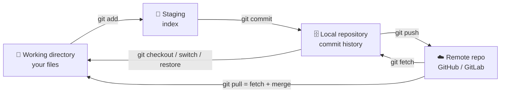

> 💡 Almost all confusion in Git disappears once you know which zone your changes are in right now. `git status` always tells you.

---

## ⚡ Top 15: Everyday Commands

```bash
git status                              # 🟢 what changed
git add <file>                          # 🟡 add to staging
git commit -m "feat: description"       # 🟡 record a commit
git push                                # 🟡 send to the server
git pull                                # 🟡 get changes from the server
git switch -c <branch>                  # 🟡 create a branch and switch to it
git switch <branch>                     # 🟡 switch to a branch
git log --oneline --graph --decorate    # 🟢 compact history
git diff                                # 🟢 what changed (not yet staged)
git diff --staged                       # 🟢 what will go into the next commit
git stash push -m "description"         # 🟡 set aside uncommitted work
git restore <file>                      # 🔴 discard changes in a file
git commit --amend                      # 🟡 fix the last commit
git reflog                              # 🟢 "black box" of all movements
git fetch --prune                       # 🟢 refresh info about the server
```

> [!IMPORTANT]
> **Golden rule:** commit often, in small logical chunks. Committed code is almost impossible to lose; uncommitted code is easy to lose.

---

# 🔧 1. Initial Setup

`#config` `#setup`

```bash
sudo dnf install git                                  # 🟡 install Git on Fedora

git config --global user.name  "Serhii"               # 🟡 name used in commits
git config --global user.email "you@example.com"      # 🟡 email (matches GitHub)
git config --global init.defaultBranch main           # 🟡 default branch is called main
git config --global pull.rebase false                 # 🟡 pull = merge (predictable behavior)
git config --global core.editor "nano"                # 🟡 editor for messages
git config --global --list                            # 🟢 check settings
```

## 🔑 SSH Key for GitHub 🆕

```bash
ssh-keygen -t ed25519 -C "you@example.com"            # 🟢 generate a key
cat ~/.ssh/id_ed25519.pub                             # 🟢 copy the public part into GitHub → Settings → SSH keys
ssh -T git@github.com                                 # 🟢 test the connection
```

> [!WARNING]
> Never share or commit the `id_ed25519` file (the one without `.pub`). It is your private key.

## 🧩 Handy Aliases 🆕

```bash
git config --global alias.st "status -sb"
git config --global alias.lg "log --oneline --graph --decorate --all"
git config --global alias.last "log -1 HEAD --stat"
git config --global alias.unstage "restore --staged"
```

Afterwards: `git st`, `git lg`, `git last`, `git unstage <file>`.

---

# 🚀 2. Starting a Project: init and clone

`#init` `#clone`

```bash
git init                                # 🟢 create a repository in the current folder
git clone <url>                         # 🟢 copy a repository
git clone <url> <folder>                # 🟢 clone into a different folder
git clone --depth 1 <url>               # 🟢 latest state only (fast, no history) 🆕
```

## 🔗 Connecting an Existing Project to GitHub


```bash
git init
git add .
git commit -m "chore: initial commit"
git branch -M main                                    # 🟡 make sure the branch is named main
git remote add origin git@github.com:<user>/<repo>.git
git push -u origin main                               # 🟡 -u remembers the branch link
```

---

# 📝 3. Daily Cycle: Changes → Commit

`#commit` `#staging`

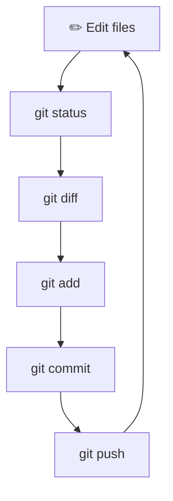

| Action | Command |
|---|---|
| 🟢 Repository state | `git status` (short: `git status -sb`) |
| 🟢 Changes not yet staged | `git diff` |
| 🟢 Changes in staging | `git diff --staged` |
| 🟡 Add a file | `git add <file>` |
| 🟡 Add everything changed | `git add -A` |
| 🟡 Add in parts (interactive) 🆕 | `git add -p` |
| 🟡 Remove from staging | `git restore --staged <file>` |
| 🟡 Commit | `git commit -m "message"` |
| 🟡 Stage tracked files + commit 🆕 | `git commit -am "message"` |
| 🟡 Fix the last commit | `git commit --amend` |
| 🟡 Add a forgotten file to the last commit 🆕 | `git add <file> && git commit --amend --no-edit` |
| 🟡 Delete a file from Git and disk | `git rm <file>` |
| 🟡 Remove from Git, keep on disk 🆕 | `git rm --cached <file>` |
| 🟡 Rename/move 🆕 | `git mv <old> <new>` |

> 💡 `git add -p` lets you pick only the chunks of changes you want, so commits stay clean and logical.

## ✍️ How to Write Commit Messages

**Conventional Commits** format: `type: short description` (up to ~70 characters, in the imperative mood).

| Type | When to use | Example |
|---|---|---|
| `feat` | new feature | `feat: add /parks endpoint` |
| `fix` | bug fix | `fix: handle 500 on empty request` |
| `docs` | documentation | `docs: describe running via Docker` |
| `refactor` | code change without behavior change | `refactor: move logic into a service` |
| `test` | tests | `test: cover authorization` |
| `chore` | housekeeping (dependencies, configs) | `chore: update requirements` |
| `style` | formatting | `style: apply black` |

---

# 🌿 4. Branches

`#branch`

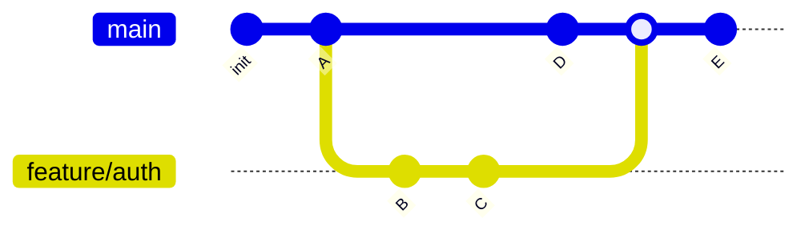

| Action | Command |
|---|---|
| 🟢 List local branches | `git branch` |
| 🟢 All branches (including remote) | `git branch -a` |
| 🟢 Latest activity per branch 🆕 | `git branch -vv` |
| 🟡 Create and switch | `git switch -c <branch>` |
| 🟡 Switch | `git switch <branch>` |
| 🟡 Go back to the previous branch 🆕 | `git switch -` |
| 🟡 Rename the current one | `git branch -m <new_name>` |
| 🟡 Delete (if already merged) | `git branch -d <branch>` |
| 🔴 Force delete | `git branch -D <branch>` |
| 🟡 Delete on the server | `git push origin --delete <branch>` |
| 🟢 Which branches are already merged into main 🆕 | `git branch --merged main` |

## 🏷️ Branch Naming

| Prefix | Purpose | Example |
|---|---|---|
| `feature/` | new functionality | `feature/user-auth` |
| `fix/` | bug fixes | `fix/login-timeout` |
| `hotfix/` | urgent production fix | `hotfix/payment-crash` |
| `refactor/` | refactoring | `refactor/db-layer` |
| `docs/` | documentation | `docs/readme` |

---

# 🔀 5. Merge, Rebase, and Conflicts

`#merge` `#rebase` `#conflicts`

## 🔹 Merge vs Rebase: The Difference

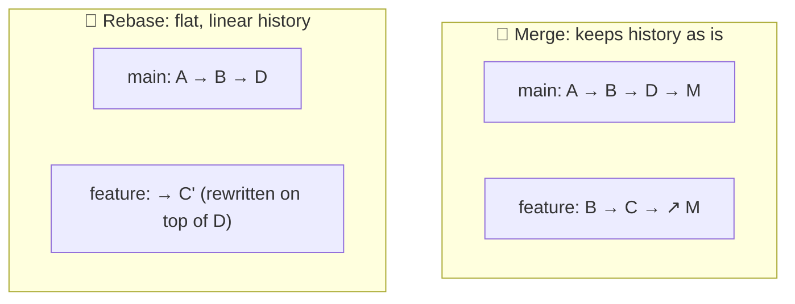

| | Merge | Rebase |
|---|---|---|
| History | fully preserved, with a merge commit | linear, "tidy" |
| Safety | 🟢 safer | 🟡 rewrites commits |
| When | merging a branch into `main` | updating your branch with fresh `main` |

> [!CAUTION]
> **Golden rule of rebase:** never rebase a branch that you've already pushed and that others are working on. Rebase changes commit IDs.

```bash
# 🟡 Merge a branch into main
git switch main
git pull
git merge <branch>                      # add --no-ff to always create a merge commit 🆕

# 🟡 Update your branch with fresh main
git switch <branch>
git fetch origin
git rebase origin/main

# 🟡 Interactive rebase: clean up the last 3 commits (squash, reword, drop) 🆕
git rebase -i HEAD~3

# 🟡 Take one specific commit from another branch 🆕
git cherry-pick <commit_hash>
```

## 🔹 Resolving Conflicts

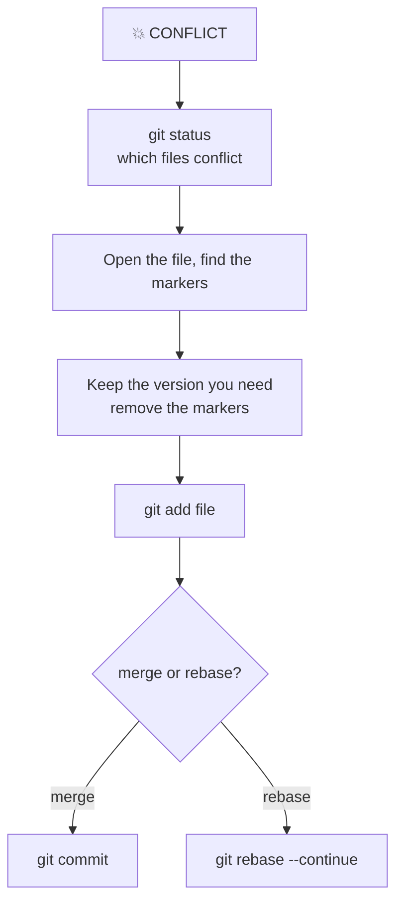

This is what a conflict looks like in a file:

```text
<<<<<<< HEAD
your version
=======
version from the other branch
>>>>>>> feature/auth
```

```bash
git merge --abort                       # 🟢 cancel the merge, return to the pre-merge state
git rebase --abort                      # 🟢 cancel the rebase
git checkout --ours   <file>            # 🟡 take our version of the file (during merge) 🆕
git checkout --theirs <file>            # 🟡 take their version of the file (during merge) 🆕
```

> 💡 Not sure what exactly broke: `git diff --name-only --diff-filter=U` shows only files with unresolved conflicts.

---

# ☁️ 6. Remote Repositories

`#remote` `#push` `#pull`

```bash
git remote -v                                         # 🟢 which remotes are configured
git remote add origin <url>                           # 🟡 add a remote
git remote set-url origin <new_url>                   # 🟡 change the address
git remote add upstream <original_url>                # 🟡 for forks 🆕

git fetch                                             # 🟢 download changes without changing anything
git fetch --prune                                     # 🟢 + remove references to deleted branches
git pull                                              # 🟡 fetch + merge
git pull --rebase                                     # 🟡 fetch + rebase (flatter history) 🆕
git push                                              # 🟡 send
git push -u origin <branch>                           # 🟡 push a new branch for the first time
git push --force-with-lease                           # 🔴 safer force-push 🆕
```

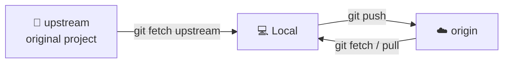

> [!WARNING]
> **Never** run `git push --force` to a shared branch (`main`). If force is necessary on your own branch, use `--force-with-lease`: it refuses if the server has someone else's commits you haven't seen.

---

# 🔍 7. History and Search

`#log` `#diff` `#blame`

| Action | Command |
|---|---|
| 🟢 Compact history | `git log --oneline` |
| 🟢 Graph of all branches | `git log --oneline --graph --decorate --all` |
| 🟢 History of a single file | `git log --follow -p <file>` |
| 🟢 Last N commits | `git log -5` |
| 🟢 Changes in a commit | `git show <hash>` |
| 🟢 Commits by author | `git log --author="Serhii"` |
| 🟢 For a period | `git log --since="2 weeks ago"` |
| 🟢 Search commit messages | `git log --grep="auth"` |
| 🟢 When a line was added/removed 🆕 | `git log -S"function_name"` |
| 🟢 Who changed each line | `git blame <file>` |
| 🟢 Compare branches | `git diff main..<branch>` |
| 🟢 Change statistics 🆕 | `git diff --stat` |
| 🟢 Files changed in a commit 🆕 | `git show --name-only <hash>` |

## 🎯 Binary Search for a Bug (bisect) 🆕

When "it used to work, but now it doesn't":

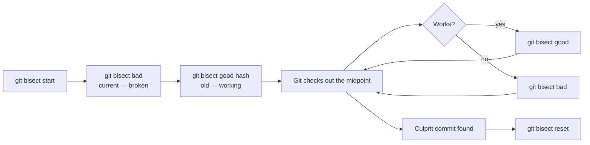

---

# ⏪ 8. Undo and Recovery

`#undo` `#reset` `#revert` `#reflog`

## 🧭 What exactly do I want to undo?

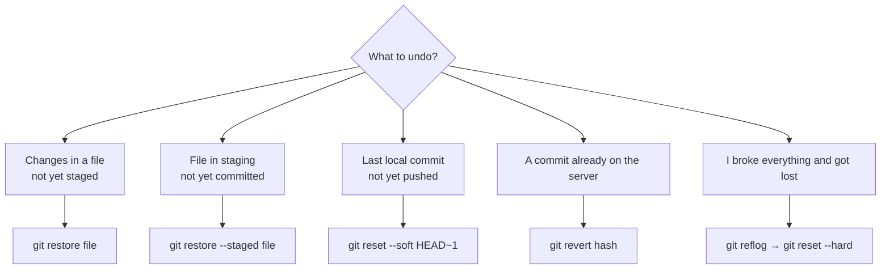

| Situation | Command | Risk |
|---|---|---|
| Discard changes in a file | `git restore <file>` | 🔴 changes are gone for good |
| Remove a file from staging | `git restore --staged <file>` | 🟢 |
| Undo a commit, **keep** changes in staging | `git reset --soft HEAD~1` | 🟡 |
| Undo a commit, keep changes in files | `git reset --mixed HEAD~1` | 🟡 |
| Undo a commit and **destroy** changes | `git reset --hard HEAD~1` | 🔴 |
| Safely undo an already published commit | `git revert <hash>` | 🟢 creates a new commit |
| Restore a file from another commit | `git restore --source=<hash> <file>` | 🟡 |
| Remove untracked files (preview first) | `git clean -n` | 🟢 |
| Actually delete untracked files | `git clean -fd` | 🔴 |

### The reset Difference: --soft, --mixed, --hard

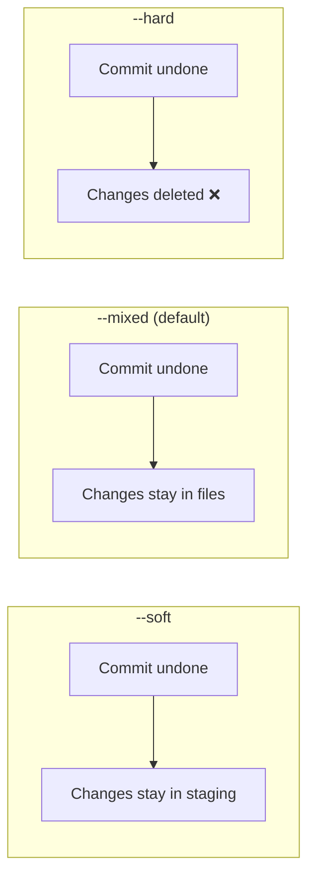

> [!TIP]
> **Safety rule:** use `reset` for local, not-yet-published commits. Use `revert` for anything already on the server.

## 🛟 Reflog: Rescuing "Lost" Work

```bash
git reflog                              # 🟢 log of all HEAD movements (kept ~90 days)
git reset --hard HEAD@{2}               # 🔴 return to the state 2 steps ago
git switch -c rescue <hash>             # 🟢 create a branch from a "lost" commit
```

> 💡 Deleted a branch with unmerged work? Find its last commit in `git reflog`, then `git switch -c rescue <hash>`. The data is still there.

---

# 📦 9. Stash: Set Work Aside

`#stash`

When you urgently need to switch to another branch, but your current changes aren't ready to commit:

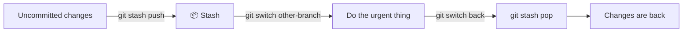

```bash
git stash push -m "description"         # 🟡 stash changes (tracked files)
git stash push -u -m "description"      # 🟡 stash new (untracked) files too 🆕
git stash list                          # 🟢 list stashes
git stash show -p stash@{0}             # 🟢 what's inside 🆕
git stash pop                           # 🟡 restore the latest and remove it from the stash
git stash apply stash@{1}               # 🟡 restore, keeping a copy in the stash
git stash drop stash@{0}                # 🔴 delete a stash
```

---

# 🏷️ 10. Tags and Releases

`#tags` `#release`

```bash
git tag                                 # 🟢 list tags
git tag v1.0.0                          # 🟡 lightweight tag
git tag -a v1.0.0 -m "First release"    # 🟡 annotated tag (recommended)
git push origin v1.0.0                  # 🟡 push a tag
git push origin --tags                  # 🟡 push all tags
git tag -d v1.0.0                       # 🟡 delete locally
git push origin --delete v1.0.0         # 🔴 delete on the server
```

> 💡 Use semantic versions **MAJOR.MINOR.PATCH**: `2.4.1`. Bump MAJOR for incompatible changes, MINOR for new features, PATCH for fixes.

---

# 🙈 11. .gitignore for Python Projects

`#gitignore` `#python` `#security`

A `.gitignore` file in the project root (template for FastAPI / Django):

```gitignore
# Virtual environments
.venv/
venv/
env/

# Python
__pycache__/
*.py[cod]
*.egg-info/
.pytest_cache/
.mypy_cache/
.ruff_cache/

# Secrets and environment configs
.env
.env.*
!.env.example
*.pem
*.key

# Databases and local data
*.sqlite3
*.db
db.sqlite3

# Django
staticfiles/
media/

# Docker
docker-compose.override.yml

# IDE and OS
.vscode/
.idea/
.DS_Store
```

```bash
git check-ignore -v <file>              # 🟢 why a file is ignored
git rm --cached <file>                  # 🟡 stop tracking an already added file
git rm -r --cached .                    # 🟡 re-read .gitignore for the whole project
```

> [!CAUTION]
> `.gitignore` only works for files that are **not yet** tracked. If `.env` has already been committed, ignoring it won't help. See the "I committed .env / password / token" scenario below.

> 💡 Keep a `.env.example` file in the repository with variable names but no real values, so it's clear what needs to be configured.

---

# 🤝 12. Team Workflow (GitHub Flow)

`#workflow` `#pullrequest`

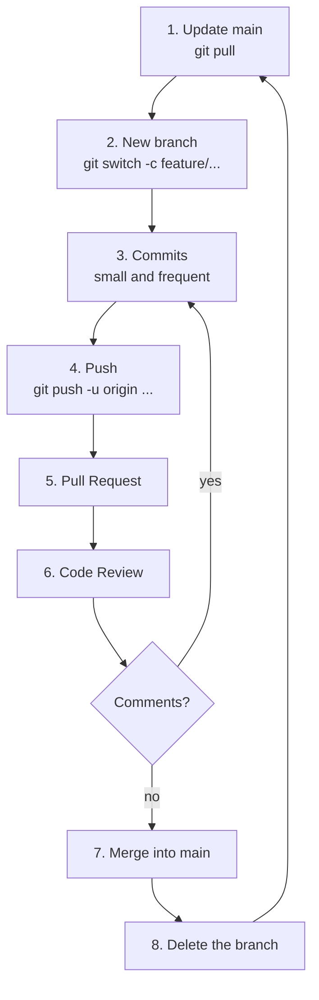

```bash
# Full cycle of a single task
git switch main && git pull
git switch -c feature/add-search
# ... work, commits ...
git fetch origin
git rebase origin/main                  # 🟡 pull in fresh main (while the branch is only yours)
git push -u origin feature/add-search
# ... Pull Request on GitHub, review, merge ...
git switch main && git pull
git branch -d feature/add-search        # 🟡 remove the local branch
git fetch --prune                       # 🟢 clean up vanished remote references
```

## 🖥️ GitHub CLI (optional) 🆕

```bash
sudo dnf install gh                     # 🟡 install
gh auth login                           # 🟡 authenticate
gh pr create --fill                     # 🟡 create a Pull Request from commit data
gh pr list                              # 🟢 list PRs
gh pr checkout <number>                 # 🟡 check out someone else's PR locally
gh repo clone <user>/<repo>             # 🟢 clone
```

---

# 🚑 13. SOS Scenarios

## 😱 "I committed to main instead of a new branch"

```bash
git switch -c feature/my-work           # 1. the new branch keeps the commits
git switch main
git reset --hard origin/main            # 2. 🔴 return main to the server's state
```

## 🔑 "I committed .env / password / token"

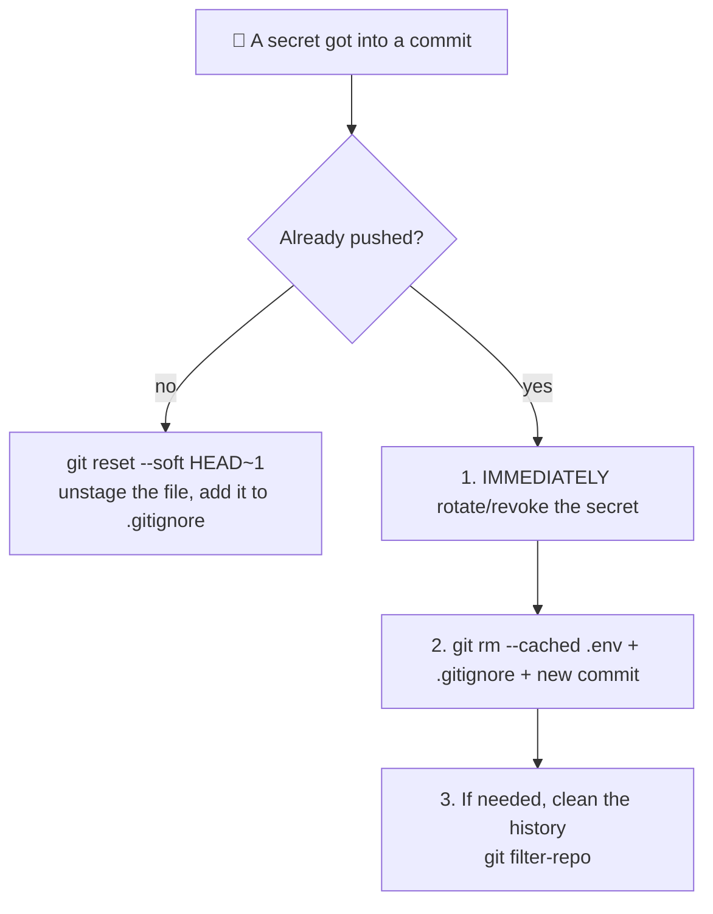

> [!CAUTION]
> If the secret is already on the server, consider it **compromised**. First revoke/reissue the key or password; cleaning history is secondary, since copies may already have reached other hands or caches.

## ✏️ "Typo in the last commit message"

```bash
git commit --amend -m "correct message"     # 🟡 only if it hasn't been pushed yet
```

## 🗑️ "I accidentally deleted a branch"

```bash
git reflog                              # find the hash of the branch's last commit
git switch -c <branch> <hash>           # restore it
```

## 🧨 "I broke everything, I want it like the server"

```bash
git fetch origin
git reset --hard origin/main            # 🔴 local branch = exact copy of the server
git clean -fd                           # 🔴 + remove untracked files (run git clean -n first)
```

## 🔁 "Push rejected: non-fast-forward"

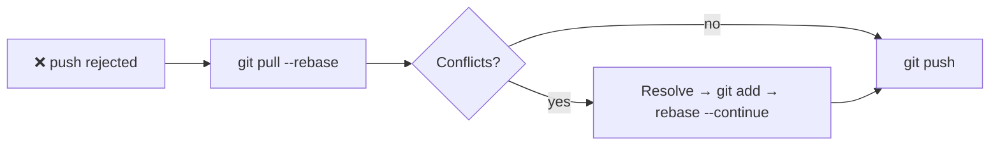

## 🐌 "I committed a huge file / `.venv`"

```bash
git rm -r --cached .venv                # 🟡 stop tracking it
echo ".venv/" >> .gitignore
git commit -m "chore: remove .venv from the repository"
```

> 💡 If the file is already in the remote history, it stays there. Fully cleaning it requires `git filter-repo` (a separate tool: `sudo dnf install git-filter-repo`) and a force-push, which must be coordinated with the team.

---

# 🏷️ Tag Index

| Tag | Section |
|---|---|
| `#config` `#setup` | 🔧 Setup |
| `#init` `#clone` | 🚀 Starting a project |
| `#commit` `#staging` | 📝 Daily cycle |
| `#branch` | 🌿 Branches |
| `#merge` `#rebase` `#conflicts` | 🔀 Merge / Rebase |
| `#remote` `#push` `#pull` | ☁️ Remote repositories |
| `#log` `#diff` `#blame` | 🔍 History |
| `#undo` `#reset` `#revert` `#reflog` | ⏪ Undo |
| `#stash` | 📦 Stash |
| `#tags` `#release` | 🏷️ Tags |
| `#gitignore` `#security` | 🙈 .gitignore |
| `#workflow` `#pullrequest` | 🤝 GitHub Flow |

---

<div align="center">

**🧰 Tip:** before any risky command, create a safety branch: `git branch backup-before-experiment`.

*Commits don't disappear. Only uncommitted work does.* 🌿

</div>