<div align="center">

# 🌿 GIT · ШПАРГАЛКА ДЛЯ РОБОТИ З ПРОЕКТАМИ

**Від першого коміту до розв'язання конфліктів і порятунку «втраченого» коду**

*Особистий довідник: знайшов → скопіював → виконав*


</div>

---

## 🧭 Як користуватися

| Позначка | Значення |
|:---:|---|
| 🟢 | Безпечно, нічого не змінює або легко скасувати |
| 🟡 | Змінює історію чи файли, перевір перед запуском |
| 🔴 | Може незворотно втратити роботу, спершу створи резервну гілку |
| 💡 | Корисна порада |
| 🆕 | Додатково до базового набору |

> [!TIP]
> Шукай команду через `Ctrl+F` за тегом, наприклад `#undo`, `#branch`, `#stash`.
> `<...>` у командах означає, що значення потрібно підставити своє.

---

## 📑 Зміст

1. [⚡ Топ-15: команди на кожен день](#-топ-15-команди-на-кожен-день)
2. [🔧 Початкове налаштування](#-1-початкове-налаштування)
3. [🚀 Старт проєкту: init і clone](#-2-старт-проєкту-init-і-clone)
4. [📝 Щоденний цикл: зміни → коміт](#-3-щоденний-цикл-зміни--коміт)
5. [🌿 Гілки](#-4-гілки)
6. [🔀 Merge, Rebase та конфлікти](#-5-merge-rebase-та-конфлікти)
7. [☁️ Віддалені репозиторії](#️-6-віддалені-репозиторії)
8. [🔍 Історія та пошук](#-7-історія-та-пошук)
9. [⏪ Скасування та відновлення](#-8-скасування-та-відновлення)
10. [📦 Stash: відкласти роботу](#-9-stash-відкласти-роботу)
11. [🏷️ Теги та релізи](#️-10-теги-та-релізи)
12. [🙈 .gitignore для Python-проєктів](#-11-gitignore-для-python-проєктів)
13. [🤝 Командний процес (GitHub Flow)](#-12-командний-процес-github-flow)
14. [🚑 SOS-сценарії](#-13-sos-сценарії)
15. [🏷️ Індекс тегів](#️-індекс-тегів)

---

## 🗺️ Як Git «думає»: чотири зони

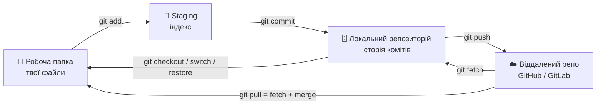

> 💡 Майже вся плутанина в Git зникає, коли розумієш, у якій зоні зараз твої зміни. Команда `git status` завжди це показує.

---

## ⚡ Топ-15: команди на кожен день

```bash
git status                              # 🟢 що змінилось
git add <файл>                          # 🟡 додати у staging
git commit -m "feat: опис"              # 🟡 зафіксувати
git push                                # 🟡 відправити на сервер
git pull                                # 🟡 забрати зміни з сервера
git switch -c <гілка>                   # 🟡 створити гілку й перейти
git switch <гілка>                      # 🟡 перейти на гілку
git log --oneline --graph --decorate   # 🟢 компактна історія
git diff                                # 🟢 що змінено (ще не в staging)
git diff --staged                       # 🟢 що піде в наступний коміт
git stash push -m "опис"                # 🟡 відкласти незакомічене
git restore <файл>                      # 🔴 відкинути зміни у файлі
git commit --amend                      # 🟡 виправити останній коміт
git reflog                              # 🟢 «чорна скринька» всіх переміщень
git fetch --prune                       # 🟢 оновити інформацію про сервер
```

> [!IMPORTANT]
> **Золоте правило:** комітся часто, маленькими логічними шматками. Закомічений код майже неможливо втратити, а незакомічений легко.

---

# 🔧 1. Початкове налаштування

`#config` `#setup`

```bash
sudo dnf install git                                  # 🟡 встановити Git на Fedora

git config --global user.name  "Serhii"               # 🟡 ім'я в комітах
git config --global user.email "you@example.com"      # 🟡 пошта (збігається з GitHub)
git config --global init.defaultBranch main           # 🟡 головна гілка називається main
git config --global pull.rebase false                 # 🟡 pull = merge (передбачувана поведінка)
git config --global core.editor "nano"                # 🟡 редактор для повідомлень
git config --global --list                            # 🟢 перевірити налаштування
```

## 🔑 SSH-ключ для GitHub 🆕

```bash
ssh-keygen -t ed25519 -C "you@example.com"            # 🟢 згенерувати ключ
cat ~/.ssh/id_ed25519.pub                             # 🟢 скопіювати публічну частину у GitHub → Settings → SSH keys
ssh -T git@github.com                                 # 🟢 перевірити зв'язок
```

> [!WARNING]
> Ніколи не віддавай і не коміть файл `id_ed25519` (без `.pub`). Це твій приватний ключ.

## 🧩 Зручні псевдоніми (aliases) 🆕

```bash
git config --global alias.st "status -sb"
git config --global alias.lg "log --oneline --graph --decorate --all"
git config --global alias.last "log -1 HEAD --stat"
git config --global alias.unstage "restore --staged"
```

Після цього: `git st`, `git lg`, `git last`, `git unstage <файл>`.

---

# 🚀 2. Старт проєкту: init і clone

`#init` `#clone`

```bash
git init                                # 🟢 створити репозиторій у поточній папці
git clone <url>                         # 🟢 скопіювати репозиторій
git clone <url> <папка>                 # 🟢 клонувати в іншу папку
git clone --depth 1 <url>               # 🟢 лише останній стан (швидко, без історії) 🆕
```

## 🔗 Підключення існуючого проєкту до GitHub

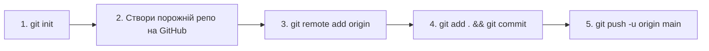

```bash
git init
git add .
git commit -m "chore: перший коміт"
git branch -M main                                    # 🟡 гарантувати назву гілки main
git remote add origin git@github.com:<користувач>/<репо>.git
git push -u origin main                               # 🟡 -u запам'ятовує зв'язок гілок
```

---

# 📝 3. Щоденний цикл: зміни → коміт

`#commit` `#staging`

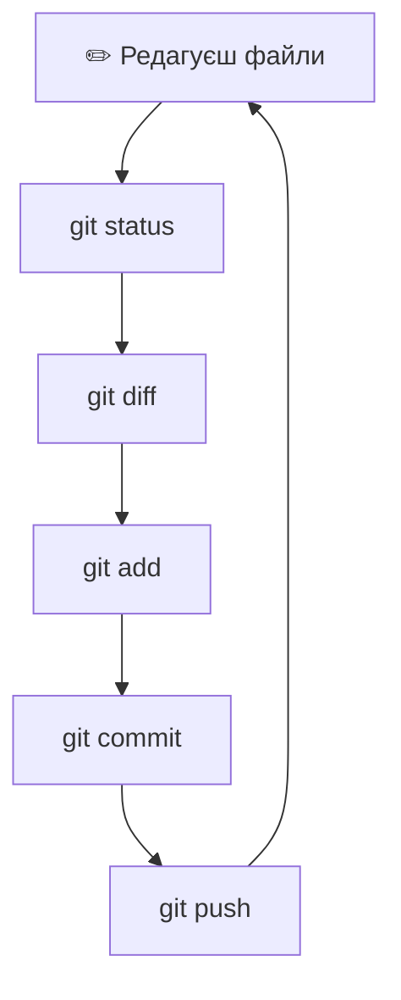

| Дія | Команда |
|---|---|
| 🟢 Стан репозиторію | `git status` (коротко: `git status -sb`) |
| 🟢 Зміни до staging | `git diff` |
| 🟢 Зміни у staging | `git diff --staged` |
| 🟡 Додати файл | `git add <файл>` |
| 🟡 Додати все змінене | `git add -A` |
| 🟡 Додавати частинами (інтерактивно) 🆕 | `git add -p` |
| 🟡 Прибрати з staging | `git restore --staged <файл>` |
| 🟡 Коміт | `git commit -m "повідомлення"` |
| 🟡 Додати відстежувані файли + коміт 🆕 | `git commit -am "повідомлення"` |
| 🟡 Виправити останній коміт | `git commit --amend` |
| 🟡 Додати забутий файл до останнього коміту 🆕 | `git add <файл> && git commit --amend --no-edit` |
| 🟡 Видалити файл з Git і диска | `git rm <файл>` |
| 🟡 Видалити з Git, залишити на диску 🆕 | `git rm --cached <файл>` |
| 🟡 Перейменувати/перемістити 🆕 | `git mv <старе> <нове>` |

> 💡 `git add -p` дозволяє відібрати лише потрібні шматки змін, щоб коміти були чистими та логічними.

## ✍️ Як писати повідомлення комітів

Формат **Conventional Commits**: `тип: короткий опис` (до ~70 символів, у наказовому способі).

| Тип | Коли використовувати | Приклад |
|---|---|---|
| `feat` | нова функція | `feat: додати ендпоінт /parks` |
| `fix` | виправлення помилки | `fix: виправити 500 при пустому запиті` |
| `docs` | документація | `docs: описати запуск через Docker` |
| `refactor` | зміна коду без зміни поведінки | `refactor: винести логіку в сервіс` |
| `test` | тести | `test: покрити авторизацію` |
| `chore` | службове (залежності, конфіги) | `chore: оновити requirements` |
| `style` | форматування | `style: застосувати black` |

---

# 🌿 4. Гілки

`#branch`

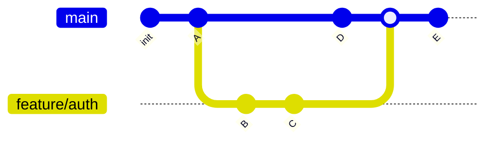

| Дія | Команда |
|---|---|
| 🟢 Список локальних гілок | `git branch` |
| 🟢 Усі гілки (з віддаленими) | `git branch -a` |
| 🟢 Остання активність у гілках 🆕 | `git branch -vv` |
| 🟡 Створити і перейти | `git switch -c <гілка>` |
| 🟡 Перейти | `git switch <гілка>` |
| 🟡 Повернутись на попередню гілку 🆕 | `git switch -` |
| 🟡 Перейменувати поточну | `git branch -m <нова_назва>` |
| 🟡 Видалити (якщо вже влита) | `git branch -d <гілка>` |
| 🔴 Видалити примусово | `git branch -D <гілка>` |
| 🟡 Видалити на сервері | `git push origin --delete <гілка>` |
| 🟢 Які гілки вже влиті в main 🆕 | `git branch --merged main` |

## 🏷️ Іменування гілок

| Префікс | Призначення | Приклад |
|---|---|---|
| `feature/` | нова функціональність | `feature/user-auth` |
| `fix/` | виправлення | `fix/login-timeout` |
| `hotfix/` | термінове виправлення продакшну | `hotfix/payment-crash` |
| `refactor/` | рефакторинг | `refactor/db-layer` |
| `docs/` | документація | `docs/readme` |

---

# 🔀 5. Merge, Rebase та конфлікти

`#merge` `#rebase` `#conflicts`

## 🔹 Merge та Rebase: різниця

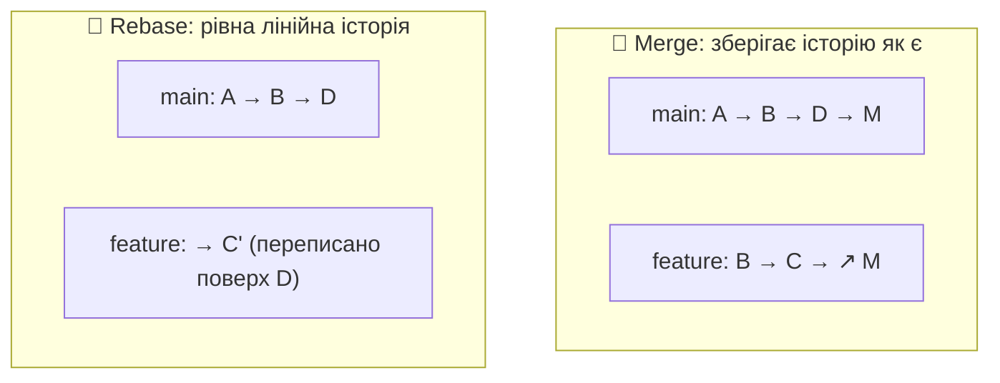

| | Merge | Rebase |
|---|---|---|
| Історія | зберігається повністю, з комітом злиття | лінійна, «акуратна» |
| Безпека | 🟢 безпечніше | 🟡 переписує коміти |
| Коли | вливаєш гілку в `main` | оновлюєш свою гілку свіжим `main` |

> [!CAUTION]
> **Золоте правило rebase:** ніколи не роби rebase гілки, яку вже відправив на сервер і з якою працюють інші. Rebase змінює ідентифікатори комітів.

```bash
# 🟡 Влити гілку в main
git switch main
git pull
git merge <гілка>                       # додай --no-ff, щоб завжди створювати merge-коміт 🆕

# 🟡 Оновити свою гілку свіжим main
git switch <гілка>
git fetch origin
git rebase origin/main

# 🟡 Інтерактивний rebase: почистити останні 3 коміти (squash, reword, drop) 🆕
git rebase -i HEAD~3

# 🟡 Забрати один конкретний коміт з іншої гілки 🆕
git cherry-pick <хеш_коміту>
```

## 🔹 Розв'язання конфліктів

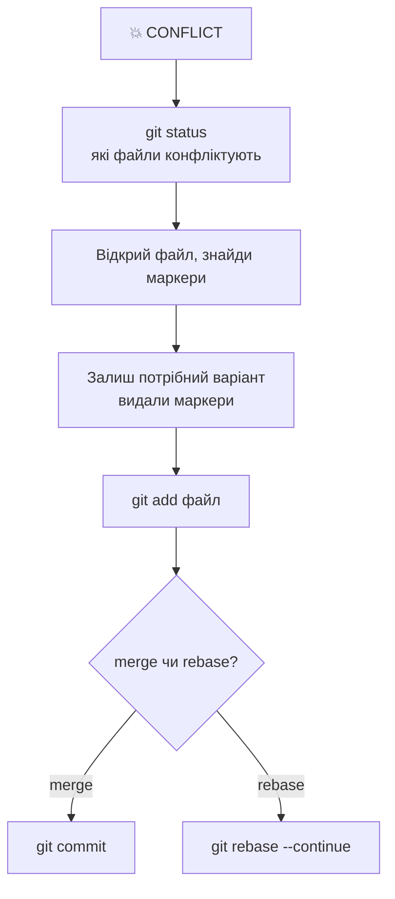

Так виглядає конфлікт у файлі:

```text
<<<<<<< HEAD
твій варіант
=======
варіант з іншої гілки
>>>>>>> feature/auth
```

```bash
git merge --abort                       # 🟢 скасувати злиття, повернутись до стану до merge
git rebase --abort                      # 🟢 скасувати rebase
git checkout --ours   <файл>            # 🟡 взяти нашу версію файлу (під час merge) 🆕
git checkout --theirs <файл>            # 🟡 взяти їхню версію файлу (під час merge) 🆕
```

> 💡 Не знаєш, що саме зламалось: `git diff --name-only --diff-filter=U` покаже лише файли з нерозв'язаними конфліктами.

---

# ☁️ 6. Віддалені репозиторії

`#remote` `#push` `#pull`

```bash
git remote -v                                         # 🟢 які remote підключені
git remote add origin <url>                           # 🟡 додати remote
git remote set-url origin <новий_url>                 # 🟡 змінити адресу
git remote add upstream <url_оригіналу>               # 🟡 для форків 🆕

git fetch                                             # 🟢 завантажити зміни, нічого не змінюючи
git fetch --prune                                     # 🟢 + прибрати посилання на видалені гілки
git pull                                              # 🟡 fetch + merge
git pull --rebase                                     # 🟡 fetch + rebase (рівніша історія) 🆕
git push                                              # 🟡 відправити
git push -u origin <гілка>                            # 🟡 вперше відправити нову гілку
git push --force-with-lease                           # 🔴 безпечніший force-push 🆕
```

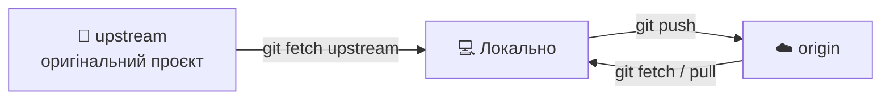

> [!WARNING]
> **Ніколи** не роби `git push --force` у спільну гілку (`main`). Якщо force необхідний у своїй гілці, використовуй `--force-with-lease`: він відмовить, якщо на сервері є чужі коміти, яких ти не бачив.

---

# 🔍 7. Історія та пошук

`#log` `#diff` `#blame`

| Дія | Команда |
|---|---|
| 🟢 Компактна історія | `git log --oneline` |
| 🟢 Граф усіх гілок | `git log --oneline --graph --decorate --all` |
| 🟢 Історія одного файлу | `git log --follow -p <файл>` |
| 🟢 Останні N комітів | `git log -5` |
| 🟢 Зміни в коміті | `git show <хеш>` |
| 🟢 Коміти за автором | `git log --author="Serhii"` |
| 🟢 За період | `git log --since="2 weeks ago"` |
| 🟢 Пошук у повідомленнях | `git log --grep="auth"` |
| 🟢 Коли додали/прибрали рядок 🆕 | `git log -S"назва_функції"` |
| 🟢 Хто змінив кожен рядок | `git blame <файл>` |
| 🟢 Порівняти гілки | `git diff main..<гілка>` |
| 🟢 Статистика змін 🆕 | `git diff --stat` |
| 🟢 Файли, змінені в коміті 🆕 | `git show --name-only <хеш>` |

## 🎯 Бінарний пошук помилки (bisect) 🆕

Коли «раніше працювало, а тепер ні»:

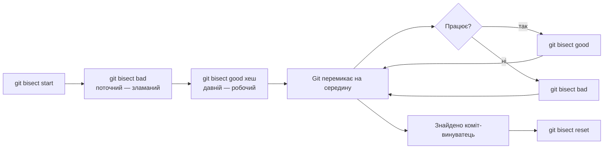

---

# ⏪ 8. Скасування та відновлення

`#undo` `#reset` `#revert` `#reflog`

## 🧭 Що саме я хочу скасувати?

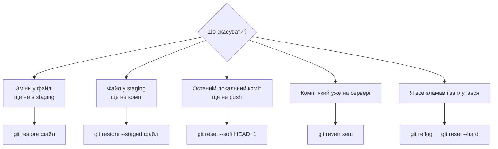

| Ситуація | Команда | Ризик |
|---|---|---|
| Відкинути зміни у файлі | `git restore <файл>` | 🔴 зміни зникнуть назавжди |
| Прибрати файл зі staging | `git restore --staged <файл>` | 🟢 |
| Скасувати коміт, **зберегти** зміни у staging | `git reset --soft HEAD~1` | 🟡 |
| Скасувати коміт, зміни залишити у файлах | `git reset --mixed HEAD~1` | 🟡 |
| Скасувати коміт і **знищити** зміни | `git reset --hard HEAD~1` | 🔴 |
| Безпечно скасувати вже опублікований коміт | `git revert <хеш>` | 🟢 створює новий коміт |
| Повернути файл з іншого коміту | `git restore --source=<хеш> <файл>` | 🟡 |
| Прибрати невідстежувані файли (спершу перегляд) | `git clean -n` | 🟢 |
| Реально видалити невідстежувані файли | `git clean -fd` | 🔴 |

### Різниця reset: --soft, --mixed, --hard

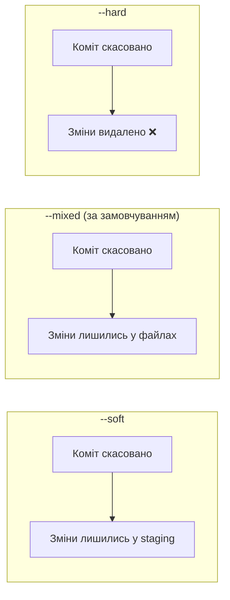

> [!TIP]
> **Правило безпеки:** `reset` для локальних, ще не опублікованих комітів. `revert` для всього, що вже на сервері.

## 🛟 Reflog: порятунок «втраченого»

```bash
git reflog                              # 🟢 журнал усіх переміщень HEAD (зберігається ~90 днів)
git reset --hard HEAD@{2}               # 🔴 повернутись до стану 2 кроки тому
git switch -c rescue <хеш>              # 🟢 створити гілку з «загубленого» коміту
```

> 💡 Видалив гілку з незливою роботою? Знайди її останній коміт у `git reflog`, потім `git switch -c rescue <хеш>`. Дані ще на місці.

---

# 📦 9. Stash: відкласти роботу

`#stash`

Коли треба терміново перейти на іншу гілку, а поточні зміни ще не готові до коміту:

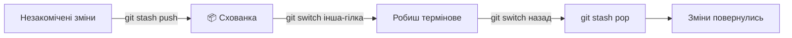

```bash
git stash push -m "опис"                # 🟡 сховати зміни (відстежувані файли)
git stash push -u -m "опис"             # 🟡 сховати й нові (untracked) файли 🆕
git stash list                          # 🟢 список схованок
git stash show -p stash@{0}             # 🟢 що всередині 🆕
git stash pop                           # 🟡 повернути останню й видалити зі схованки
git stash apply stash@{1}               # 🟡 повернути, залишивши копію у схованці
git stash drop stash@{0}                # 🔴 видалити схованку
```

---

# 🏷️ 10. Теги та релізи

`#tags` `#release`

```bash
git tag                                 # 🟢 список тегів
git tag v1.0.0                          # 🟡 легкий тег
git tag -a v1.0.0 -m "Перший реліз"     # 🟡 анотований тег (рекомендовано)
git push origin v1.0.0                  # 🟡 відправити тег
git push origin --tags                  # 🟡 відправити всі теги
git tag -d v1.0.0                       # 🟡 видалити локально
git push origin --delete v1.0.0         # 🔴 видалити на сервері
```

> 💡 Використовуй семантичні версії **MAJOR.MINOR.PATCH**: `2.4.1`. MAJOR міняєш при несумісних змінах, MINOR при нових можливостях, PATCH при виправленнях.

---

# 🙈 11. .gitignore для Python-проєктів

`#gitignore` `#python` `#security`

Файл `.gitignore` у корені проєкту (шаблон для FastAPI / Django):

```gitignore
# Віртуальні оточення
.venv/
venv/
env/

# Python
__pycache__/
*.py[cod]
*.egg-info/
.pytest_cache/
.mypy_cache/
.ruff_cache/

# Секрети та конфіги середовища
.env
.env.*
!.env.example
*.pem
*.key

# Бази даних і локальні дані
*.sqlite3
*.db
db.sqlite3

# Django
staticfiles/
media/

# Docker
docker-compose.override.yml

# IDE та ОС
.vscode/
.idea/
.DS_Store
```

```bash
git check-ignore -v <файл>              # 🟢 чому файл ігнорується
git rm --cached <файл>                  # 🟡 перестати відстежувати вже доданий файл
git rm -r --cached .                    # 🟡 перечитати .gitignore для всього проєкту
```

> [!CAUTION]
> `.gitignore` працює лише для файлів, які **ще не** відстежуються. Якщо `.env` уже потрапив у коміт, ігнорування не допоможе. Див. сценарій «Секрет у репозиторії» нижче.

> 💡 Тримай у репозиторії файл `.env.example` з назвами змінних без реальних значень, щоб було ясно, що налаштовувати.

---

# 🤝 12. Командний процес (GitHub Flow)

`#workflow` `#pullrequest`

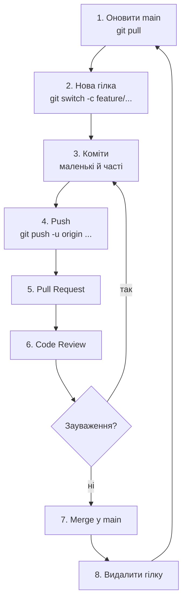

```bash
# Повний цикл однієї задачі
git switch main && git pull
git switch -c feature/add-search
# ... робота, коміти ...
git fetch origin
git rebase origin/main                  # 🟡 підтягнути свіжий main (поки гілка лише твоя)
git push -u origin feature/add-search
# ... Pull Request на GitHub, review, merge ...
git switch main && git pull
git branch -d feature/add-search        # 🟡 прибрати локальну гілку
git fetch --prune                       # 🟢 прибрати зниклі віддалені посилання
```

## 🖥️ GitHub CLI (опціонально) 🆕

```bash
sudo dnf install gh                     # 🟡 встановити
gh auth login                           # 🟡 авторизація
gh pr create --fill                     # 🟡 створити Pull Request із даних комітів
gh pr list                              # 🟢 список PR
gh pr checkout <номер>                  # 🟡 забрати чужий PR локально
gh repo clone <користувач>/<репо>       # 🟢 клонувати
```

---

# 🚑 13. SOS-сценарії

## 😱 «Закомітив у main замість нової гілки»

```bash
git switch -c feature/my-work           # 1. нова гілка зберігає коміти
git switch main
git reset --hard origin/main            # 2. 🔴 повернути main до стану сервера
```

## 🔑 «Закомітив .env / пароль / токен»

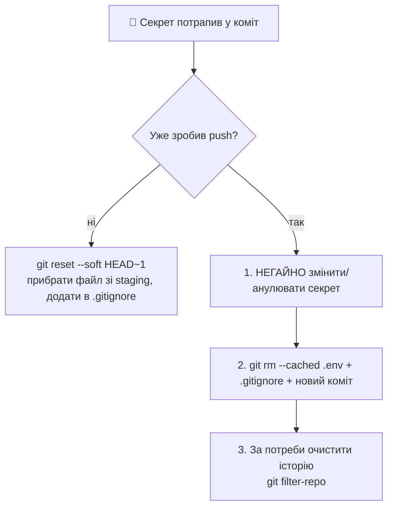

> [!CAUTION]
> Якщо секрет уже на сервері, вважай його **скомпрометованим**. Спершу відклич/перевипусти ключ чи пароль, а чистка історії вторинна: копії могли вже потрапити в чужі руки чи кеші.

## ✏️ «Помилка в повідомленні останнього коміту»

```bash
git commit --amend -m "правильне повідомлення"     # 🟡 лише якщо ще не було push
```

## 🗑️ «Випадково видалив гілку»

```bash
git reflog                              # знайди хеш останнього коміту гілки
git switch -c <гілка> <хеш>             # відновити
```

## 🧨 «Я зламав усе, хочу як на сервері»

```bash
git fetch origin
git reset --hard origin/main            # 🔴 локальна гілка = точна копія сервера
git clean -fd                           # 🔴 + прибрати невідстежувані файли (спершу git clean -n)
```

## 🔁 «Push відхилено: non-fast-forward»

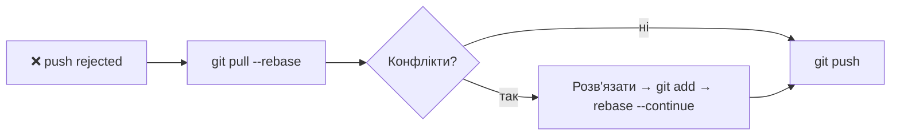

## 🐌 «Закомітив величезний файл / `.venv`»

```bash
git rm -r --cached .venv                # 🟡 прибрати з відстеження
echo ".venv/" >> .gitignore
git commit -m "chore: прибрати .venv з репозиторію"
```

> 💡 Якщо файл уже у віддаленій історії, він залишається в ній. Для повного очищення потрібен `git filter-repo` (окремий інструмент: `sudo dnf install git-filter-repo`) і force-push, що потребує узгодження з командою.

---

# 🏷️ Індекс тегів

| Тег | Розділ |
|---|---|
| `#config` `#setup` | 🔧 Налаштування |
| `#init` `#clone` | 🚀 Старт проєкту |
| `#commit` `#staging` | 📝 Щоденний цикл |
| `#branch` | 🌿 Гілки |
| `#merge` `#rebase` `#conflicts` | 🔀 Merge / Rebase |
| `#remote` `#push` `#pull` | ☁️ Віддалені репозиторії |
| `#log` `#diff` `#blame` | 🔍 Історія |
| `#undo` `#reset` `#revert` `#reflog` | ⏪ Скасування |
| `#stash` | 📦 Stash |
| `#tags` `#release` | 🏷️ Теги |
| `#gitignore` `#security` | 🙈 .gitignore |
| `#workflow` `#pullrequest` | 🤝 GitHub Flow |

---

<div align="center">

**🧰 Порада:** перед будь-якою ризикованою командою створи страхувальну гілку: `git branch backup-перед-експериментом`.

*Коміти не зникають. Зникають лише ті, що не закомічені.* 🌿

</div>